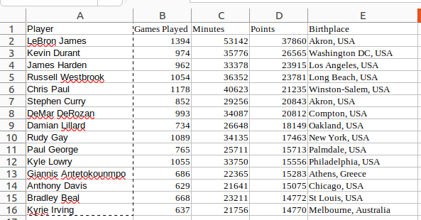
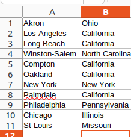
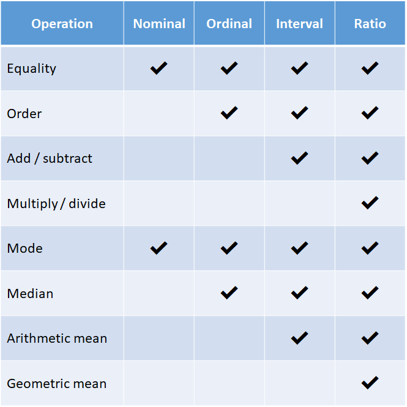
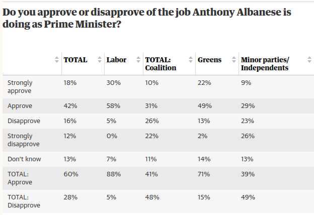

# Outline

- Data frames
- Operations on data frames
- Data types
- Data profiling 

```{r,include=FALSE}
library(reticulate)
use_python('~/anaconda3/bin/python3')
matplotlib<-import('matplotlib')
matplotlib$use("Agg",force=TRUE)
knitr::opts_chunk$set(fig.align='center',echo=FALSE,message = F,warning = F)
```

---

class: center, middle, inverse

# Data frames

---

# What is data?

- Data can be *structured* or *unstructured*
- Structured data has
  - Observations/ cases in rows
  - Variables/ features in columns
- Think of structured data as something that can be put into a spreadsheet.

---

# Example



Current as of January 2023

---

# US Cities and States



---

# Observations and variables

- In the first table:
  - What are the observations?
  - What are the variables?
- How about the second table?

---

# Pandas

.pull-left[
- The Python library *pandas* stores data in a basic object called a *data frame*.
- It also provides functions for reading in and manipulating data frames.
]
.pull-right[]

---

# NBA Data

```{python, echo=TRUE}
import pandas as pd
NBA = pd.read_csv('../data/NBA1.csv')
NBA
```

---

# Keys

- A key uniquely identifies an entry into the database.
- In the first table the player name can act as a key.
- Player birthplace could not be a key since both James and Curry are born in Akron.
- However, be careful with names as keys, since two players may have the same name.

---

# Atomicity

- Beware of variables that combine multiple pieces of information.
- Birthplace can be broken down into city and country.
- This may be useful if we want to visualise points scored by players born in USA and
players born outside USA.
- Variables should be *atomic*
- This is also known as *parsing* the data.
---

# Split

```{python, echo=TRUE}
new = NBA.Birthplace.str.split(', ',expand = True)
new
```
---

# With original table

```{python, echo=TRUE}
NBA["CityOfBirth"] = new[0]
NBA["CountryOfBirth"] = new[1]
NBA

```
---

# Another example

 <table>
  <tr>
    <th>Player</th>
    <th>Points</th>
  </tr>
  <tr>
    <td>Steph Curry</td>
    <td>20843 for Warriors</td>
  
  </tr>
  <tr>
    <td>Kevin Durant</td>
    <td>17566 for Thunder, 5374 for Warriors, 3625 for Nets</td>
  </tr>
</table> 

---

# Split 

 <table>
  <tr>
    <th>Player</th>
    <th>Points for Warriors</th>
    <th>Points for Thunder</th>
    <th>Points for Nets</th>
  </tr>
  <tr>
    <td>Steph Curry</td>
    <td>20843</td>
    <td></td>
    <td></td>
  </tr>
  <tr>
    <td>Kevin Durant</td>
    <td>5374</td>
    <td>17566</td>
    <td>3625</td>
  </tr>
</table> 

---

# Problems

- Empty cells for Steph Curry
  - Not such a big issue (see missing data later)
- What if Kevin Durant moves to another team? (He did...)
- What if we want to include Giannis (only played for Bucks)?
  - Would need new columns and code that previously worked may break.

---

# Solution

 <table>
  <tr>
    <th>Player</th>
    <th>Team</th>
    <th>Points</th>
  </tr>
  <tr>
    <td>Steph Curry</td>
    <td>Warriors</td>
    <td>20843</td>  
  </tr>
  <tr>
    <td>Kevin Durant</td>
    <td>Thunder</td>
    <td>17566</td>
  </tr>
  <tr>
    <td>Kevin Durant</td>
    <td>Warriors</td>
    <td>5374</td>
  </tr>
  <tr>
    <td>Kevin Durant</td>
    <td>Nets</td>
    <td>3625</td>
  </tr>
</table> 

---

# First Normal Form

- New data entries can be added by adding rows only.
- Now the player and team combined form key.
- Overall the example so far is about getting the data into the *first normal form*.
- For the purposes of visualisation the lesson is to think carefully about how the data is structured.
---
class: inverse, middle, center

# Operations on Data Frames

---

# The simple machines

- Hundreds of years ago, it was believed that all machines were made up of six simple machines
- These include: levers, wheels, pulleys, screws, etc.
- Nowadays machines are more complicated.
- But this is a good metaphor for data frames

---

# Simple machines of data

- We will consider six "simple machines" of data frames.
  - Transforming
  - Sorting
  - Filtering
  - Group by/ aggregate
  - Reshaping (melting and casting)
  - Joining (merging)
- By some combination of these we can 'munge' data frames into almost any data frame we need.

---

# Transform

- Create a new variable based on values of existing variables.
- For example, in the NBA data frame we have games played and points.
- Suppose we want to create a variable of points per game (PPG)

---

# Transform in Python

```{python, echo = TRUE}

NBA["PPG"]=NBA["Points"]/ NBA["Games Played"]
NBA

```

How would you get points per minute?

---


# Sort

- Suppose we want to sort the data according to one of the variables.
- We can use the `sort_values` function.
- Consider that we want to sort by minutes played from smallest to largest.

---

# Players by minutes

```{python, echo=TRUE}
NBAbymin = NBA.sort_values(by = 'Minutes')
NBAbymin
```

---

# Filter

- Filtering involves selecting only some subset of the data.
- There are many ways to do this
  - Select rows
  - Select columns
- Select by a logical condition

---

# Example 

- Suppose we only want to consider 
  - Players with points per game greater than 20
  - Players born in Akron
  - Players not born in the United States
- These are all examples of logical conditions (either true or false).

---

# Players with PPG above 20

```{python, echo=TRUE}
NBAppg20 = NBA.loc[NBA["PPG"]>20]
NBAppg20
```

---


# Players born in Akron

```{python, echo=TRUE}
NBAAkr = NBA.loc[NBA["CityOfBirth"] == 'Akron']
NBAAkr
```

Note that a single = denotes assignment, a double == denotes 'equals' in a logical statement.

---


# Players born outside USA

```{python, echo=TRUE}
NBAnonUS = NBA.loc[NBA["CountryOfBirth"] != 'USA']
NBAnonUS
```

In general we can read ! as 'not' in Python

---


# Group by / aggregate

- Suppose we want to compare total points scored by players country of birth.
- This requires two functions
  - The `groupby` function tells us the variable to group on (in this case Country of Birth).
  - The `agg` function tells us which variable to aggregate (in this case points)

---

# Groupby/aggregate in Python

```{python, echo = TRUE}

NBAg = NBA.groupby('CountryOfBirth').agg({'Points': 'sum'})
NBAg

```

Other ways to aggregate include mean, min and max.

---

# Reshape

- Often in order to produce the visualisation we want we need to reshape the data.
- This is done using two functions
  - The function `melt` converts the data from wide to long.
  - The function `pivot` converts the data from long to wide.

---

# Melting

```{python, echo=TRUE}
NBAlong = NBA.melt(id_vars=['Player'],value_vars=['Games Played', 'Minutes', 'Points'])
NBAlong
```

---

# Pivoting

```{python, echo=TRUE}
NBAwide = NBAlong.pivot(index='Player', columns = 'variable')
NBAwide
```

---

# A better example

```{python, echo=T}
Sydney = pd.read_csv('../data/SydneyClimate.csv')
Sydney
```

Retrieved from Bureau of Meteorology

---

# Melting

```{python, echo=T}
Sydlong = Sydney.melt(id_vars='Year').sort_values(by = ['Year','variable'])
Sydlong
```

---

# Plot

```{python}
import matplotlib.pyplot as plt
fig, ax = plt.subplots(figsize = (25,18))
ax.plot(range(0,72), Sydlong['value'])
plt.show()

```
---

# Merge

- Bring two data frames together
- Similar to a VLOOKUP type function in spreadsheet programs such as Excel.
- We can use `merge` to add information about State of birth for NBA players.

---

# Merge

```{python, echo =TRUE}
CitiesStates = pd.read_csv('../data/UScitiesstates.csv')
NBAmerge = pd.merge(NBA,CitiesStates, left_on = 'CityOfBirth', right_on = 'City')
NBAmerge
```
---

# Different type of merge

- Left: Keep all entries from first data frame
- Right: Keep all entries from first data frame
- Inner: Keep all entries that appear in both data frames
- Outer: Keep all entries that appear in either data frame

---

# Merge

```{python, echo =TRUE}
CitiesStates = pd.read_csv('../data/UScitiesstates.csv')
NBAmerge = pd.merge(NBA,CitiesStates, how = 'outer', left_on = 'CityOfBirth', right_on = 'City')
NBAmerge
```
---

# Putting them together

- In your own time, construct data frames for the following:
  - Each observation is a state and with the maximum points per minute (PPM) by a player from each state.
  - The same as above with states ranked from highest to lowest according to the maximum PPM.
  - The same as above but with an extra column with the player name of the player with the highest PPM in each state.
- There may be more than one correct answer.

---
class: inverse, middle, center

# Data types

---

# Data Types

- Each variable measures a certain characteristic.
- Characteristics can be measured in different ways
- This leads to *data type* which are important for understanding
  - How we can transform data.
  - The correct visualisation to use.

---

# Scales of measurement

- Any old (or new) statistics textbook will introduce four scales of measurement
  - Nominal
  - Ordinal
  - Interval
  - Ratio
- These are still useful (with some caveats).

---

# Nominal data

- Tells us something about a characteristic but there is no notion of having more or less of a characteristic.
- Example: Country of birth.
- Can you think of other examples?
- Even if we assign numbers to nominal categories, it does not make sense to find means medians etc.
- The mode still makes sense.

---

# Ordinal data

- Tells us whether we have more or less of a characteristic, but not how much more or less.
- Example: rate players as good, very good, excellent.
- If we assign numbers to nominal categories it still does not make sense to add subtract these numbers.
- However the median (and the mode) still make sense.

---

# Interval/Ratio data

- All numerical data is either interval or ratio data.
- The differences between the two concern whether the zero point of the scale truly represents an absence of the characteristic being measured.
- Best understood with an example.

---

# Points per game

- Suppose I constructed a new index for points per game (PPG) where a PPG of 20 now becomes a PPG of 0.
  - Paul George (PPG: 20.5) would have a "new" PPG of 0.5.
  - Steph Curry (PPG: 24.5) would have a "new" PPG of 4.5.
- Does this mean that Curry is scoring 9 times as much as George? No.

---

# The textbook example

- The famous example is temperature.
- The Celsius scale attaches 0 and 100 to the freezing and boiling point of water.
  - This is arbitrary
- For the Kelvin scale, zero is true zero since it is a temperature where atoms have no energy (loosely speaking).

---

# Does it matter?

- Not that much (outside of science).
- Most data we see in business are ratio data.
- In general, I will use *numeric data* and *ratio data* interchangeably.
- Just think carefully when dividing with numerical variables.

---
# Summary

.center[

]
---

# Some exceptions

- Nominal data with two categories.
  - Born in US assigned 1, born outside US assigned 0.
  - Arithmetic mean is then the *proportion* born in US.
- Likert (customer satisfaction) scales:
  - Strongly disagree = 1, Disagree = 2, etc.
  - Using an arithmetic mean is controversial but common in practice.
- Time is very unusual since calendar effects are important in business.
  
---

# Types in Pandas

```{python , echo=T}
NBA.dtypes
```

Object is text, int64 is an integer and float64 is a real number.

---
class: inverse, middle, center


# Data Profiling

---

# Some issues

- Duplicated entries
  - Can be removed using `drop_duplicates` function in pandas.
- Data entry errors
  - For example cannot score 20000 points in 3 minutes.
  - Requires domain knowledge.
  - These issues can be discovered during visualisation.

---

# Standardisations
  
- Steph Curry may appear elsewhere in the data as 
  - "Stephen Curry" 
  - "Wardell Stephen Curry II" (his full name). 
- Similar things happen with company names Facebook/ Meta, General Motors/ GM etc.
- Requires domain knowledge and some extra coding.

---

# Missing Data

- There are often missing data
- Need to think of a good strategy to encode missing data.
- In Python there is `NaN` for this.
- Often will replace with a number but this is a bad strategy

---

# Do not use "0" for "missing"

- Suppose if games played is missing and we replace with zero.
- The zeros will distort the mean.
- If we compute points per game there will be division by zero.
- Do not replace missing values by zeros.

---

# Do not use "-999" for "missing"

- Sometimes a completely implausible number such as -999 is used to denote missing.
- This can lead to strange visualisations
- The following example is for the Sydney temperature data

---

# Temperature

```{python}
Sydlong['value'] = Sydlong['value'].fillna(-999)
fig, ax = plt.subplots(figsize = (25,18))
ax.plot(range(0,72), Sydlong['value'])
plt.show()
```
---

# Dealing with missing data

- Only use complete cases
- Impute missing values
  - With a random value
  - With mean/median or mode
  - More complicated models
- Report/Visualise missing data
  - By reporting missing data this gives a better idea of uncertainty.
---

# Report missing



Source: [Guardian](https://www.theguardian.com/australia-news/commentisfree/2022/dec/13/as-2022-comes-to-a-close-australians-can-enjoy-a-reprieve-from-the-algorithms-of-fear-and-outrage)


---
class: middle, center, inverse

# Wrap-up

---

# Conclusions

- Our focus from now on will be visualisation.
- Writing code to visualise messy data is hard.
- Spend the time to clean your data.
- Focus on the *principles* since these work for Excel, Tableau, R, Python, etc.
- After you appreciate the principles, practice your coding.

---

class: middle, center, inverse

# Questions
