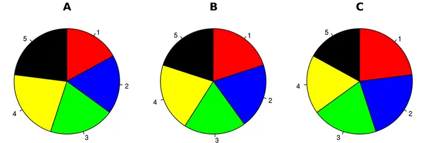
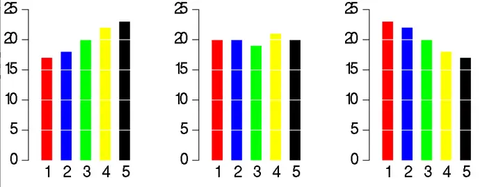
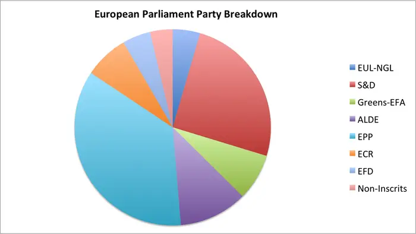
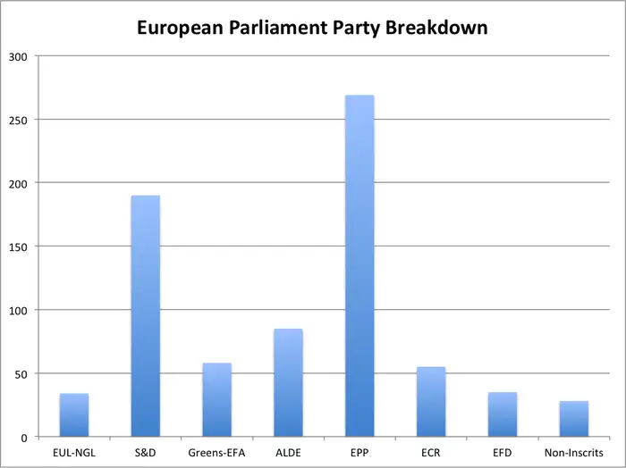
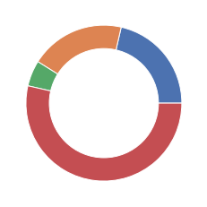
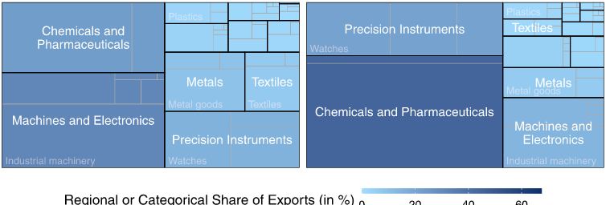

# Outline

- Nominal/Ordinal Data
  - Bar 
  - Lollipop
  - Pie/donut
- Numeric data
 - Box plot
 - Histograms
 - Kernel density

```{r,include=FALSE}
library(reticulate)
use_python('~/anaconda3/bin/python3')
matplotlib<-import('matplotlib')
matplotlib$use("Agg",force=TRUE)
knitr::opts_chunk$set(fig.align='center',echo=FALSE,message = F,warning = F)
```

---

# Motivation

- Understand the distribution of a variable
  - Find outliers
  - Find multi-modality
  - Find skew
- Understanding the distribution is about generating interesting questions for further analysis.
  
---

class: center, middle, inverse

# Categorical variables

---

# The bar chart

- Categories displayed on one axis (usually x).
- The *frequency* of each observation is displayed on the other axis (usually y).
- The frequency is mapped to the *length* of each bar.
- For this reason always include zero on the y axis.

---

# Examples

- We will use two dataets that can be directly loaded from the `seaborn` package.
  - The `taxis` dataset with data on pickup and drop off locations, fares, payment type etc., in New York City.
  - The `diamonds` dataset with information on size, cut clarity, price, etc. of diamonds.
- These contain nominal, ordinal and numeric variables.  

---

# Taxis data

```{python,echo =T}

import seaborn as sns
taxisdat = sns.load_dataset('taxis')
taxisdat
```

---

# Bar plot of pick up

```{python,echo =T, out.width="50%"}
sns.countplot(data = taxisdat, x='pickup_borough')
```

---

# Change orientation

```{python,echo =T, out.width="50%"}
sns.countplot(data = taxisdat, y='pickup_borough')
```

---


# Order by frequency

```{python,echo =T, out.width="50%"}
sns.countplot(data = taxisdat, x='pickup_borough', order = taxisdat['pickup_borough'].value_counts().index)
```

Data are nominal - this is fine.

---

# Ordinal data

- For nominal data it is suitable, to order according to frequency.
- This is not the case for ordinal data
- Always  order according to categories of the variable.
- Diamonds dataset has clarity as an ordinal variable
  - Categories ordered as IF, VVS1, VVS2, VS1, VS2, SI1, SI2, I1.

---

# Diamonds data

```{python,echo =T, out.width="45%"}
diam = sns.load_dataset('diamonds')
diam
```

---

# Ordinal   

```{python,echo =T, out.width="45%"}
diam = sns.load_dataset('diamonds')
sns.countplot(data=diam,x='clarity')
```

Categories ordered by levels of variable - this is fine.

---

#Incorrect plot

```{python,echo =F, out.width="50%"}
sns.countplot(data=diam,x='clarity', order = ['IF', 'I1', 'SI1', 'SI2', 'VS1', 'VS2', 'VVS1', 'VVS2'])
```

Incorrect. Categories in alphabetical order.

---

#Incorrect plot

```{python,echo =F, out.width="50%"}
sns.countplot(data=diam,x='clarity', order = ['I1', 'IF', 'VVS1', 'VVS2', 'VS1', 'SI2', 'VS2', 'SI1' ])
```

Incorrect. Ordered by frequency.

---

# Single color

```{python,echo =T, out.width="50%"}
diam = sns.load_dataset('diamonds')
sns.countplot(data=diam,x='clarity',color='tab:blue')
```

---

# Coloring

- Although by default categories have different colors this is not strictly necessary.
- Arguably it is distracting, especially when there are more categories.
- Later on we will use color to display data
  - For example grouping by a second variable and mapping that to color.
- This will be covered later on.

---

# Lollipop charts

- If there are 
  - A large number of categories,
  - If the categories all have similar frequncies,
- then consider using a lollipop chart.
- This can be done with some data munging using `value_counts` and the `stem` function in `matplotlib`.

---

# Data preparation

For simpler graph, will only consider dropoff in Manhattan

```{python, echo=T}
freq = taxisdat[taxisdat['pickup_borough']=='Bronx'].value_counts('pickup_zone')
freq
```

---

# Lollipop plot (code)

```{python, echo=T, eval=F}
import matplotlib.pyplot as plt
plt.stem(freq)
plt.xticks(range(1,len(freq.index)+1), freq.index, rotation='vertical')
plt.show()
```

---

# Lollipop plot (output)

```{python, echo=F, eval=T, out.width="60%", message = F, results='hide'}
import matplotlib.pyplot as plt
plt.stem(freq)
plt.xticks(range(1,len(freq.index)+1), freq.index, rotation='vertical')
plt.show()
```

---

# Pie charts

- Pie charts are considered to be poor practice by visualisation experts since
  - It is difficult to compare sizes of angles.
  - It is difficult to make comparisons unless categories are close.
  - They do not handle large numbers of categories.
- Following examples come from a [Business Insider article](https://www.businessinsider.com/pie-charts-are-the-worst-2013-6) by Walt Hickey.

---

# Pie chart



---

# Bar chart



---


# Pie chart



---

# Bar chart



---

# How to do pie charts

.pull-left[
- If you absolutely MUST do a pie chart a guide can be found at this [link](https://www.geeksforgeeks.org/how-to-create-a-pie-chart-in-seaborn/).
- A donut chart is a pie chart with a hole. It is even worse than a pie chart.
]
.pull-right[

]

---

# Treemaps

- Even bar charts can struggle when the number of categories is truly huge.
- One way to handle this is using a *treemap*.
- See [this example](https://www.datarevelations.com/in-praise-of-treemaps/)
- These are particularly well suited when categories follow a hierarchy.
- The following example considers Swiss exports that are classified into 12 categories and 48 subcategories.

---

# Swiss Exports



---

class: middle, center, inverse

# Numerical Data

---

# Histogram

- The equivalent of a bar chart for numerical data is a histogram.
- The area of each bar represents the frequency within a certain interval.
- If all bars have equal width then frquency is mapped to the length of the bars too.  
- Zero should always be included on the y axis (but not necessarily x axis).

---

# Histogram

```{python,echo =T, out.width="50%"}
sns.histplot(taxisdat['fare'])
```

---

#What do we see?

- Right skew
  - Should we use mean or median as measure of central tendency?
- A few big outliers.
- A spike (second 'mode') at around $50
  - Could represent a fixed fee (e.g. from airport).

---

# Change number of bins

```{python,echo =T, out.width="50%"}
sns.histplot(taxisdat['fare'], bins=10)
```

---

# Change number of bins

```{python,echo =T, out.width="50%"}
sns.histplot(taxisdat['fare'], bins=2000)
```

---

# Lessons

- By having too many (or too few) bins we can miss out on important features of data.
- In the above example the spike of fares around $50 is not seen when the number of bins is changed.
- In general default choice of bin number is good, howver it is always a good idea to experiment.

---

# Kernel density estimate (KDE)

- A kernel density estimates the *probability density function (pdf)* of data.
- For data $x_1,x_2,\dots,x_n$ the KDE is given by

$$\hat{f}(x)=\frac{1}{n}\sum\limits_{i=1}^{n} K_h(x-x_i)$$
- The function $K_h(.)$ is called the *kernel*.
- Can take many form.
- The function depends on a bandwidth $h$ (to be explained soon).

---

# Intuition behind KDE

- If I observe a point in some location, that evidence supports that there is probability that a point comes from a nearby region.
- Imagine I drop a mountain of sand at the location I observe the point.
- The shape of the sand is the kernel function.
- If I repeat this for $n$ observations the result is the KDE.

---

# KDE (n-1)

```{r}

x<-9

kde<-density(x, bw=0.5)

plot(kde, main='', xlim=c(0,10))
points(9,0,col='red')
```

---

# KDE (n=2)

```{r}

x<-c(1,9)

kde<-density(x, bw=0.5)

plot(kde, main='', xlim=c(0,10))
points(1,0,col='red')

```

---

# KDE (n=3)

```{r}

x<-c(1,4.1,9)

kde<-density(x, bw=0.5)

plot(kde, main='', xlim=c(0,10))
points(4.1,0,col='red')

```

---

# KDE (n=4)

```{r}

x<-c(1,4.1,5,9)

kde<-density(x, bw=0.5)

plot(kde, main='', xlim=c(0,10))
points(5,0,col='red')

```

---

# KDE (n=20)

```{r}

x<-c(1,4.1,5,9,rnorm(16,5,3))

kde<-density(x, bw=0.5)

plot(kde, main='', xlim=c(0,10))
points(x[5:20],rep(0,16),col='red')

```

---

# The bandwidth

- The bandwidth $h$ controls whether the mountain of sand is 'peaked' or 'flat' .
- For small bandwidth the mountain of sand is more peaked and the KDE is more wiggly.
- For large bandwidth the mountain of sand is more flat and the KDE is more smooth.
- There are sensible defaults used by visualisation packages.

---

#KDE plot


```{python,echo =T, out.width="50%"}
sns.kdeplot(taxisdat['fare'])
```

---

#KDE plot (double default BW)


```{python,echo =T, out.width="50%"}
sns.kdeplot(taxisdat['fare'], bw_adjust = 2)
```

---

#KDE plot (half default BW)


```{python,echo =T, out.width="50%"}
sns.kdeplot(taxisdat['fare'], bw_adjust = 0.5)
```

---


# Violin plot

- A violin plot mirrors a KDE and fills it in.
- It is particularly useful for making comparisons of density according to a grouping variable. 
- We will cover this next week.

---


#Violin plot


```{python,echo =T, out.width="50%"}
sns.violinplot(taxisdat['fare'])
```

---

# Boxplot

- Inside the violin plot is a boxplot.
- The boxplot is a summary of five statistics
  - Median
  - First Quartile
  - Third Quartile
  - Minimum
  - Maximum

---


#Box plot


```{python,echo =T, out.width="50%"}
sns.boxplot(taxisdat['fare'])
```


---

# Fences

- For most implementations, a boxplot actually shows an upper and lower fence rather than the maximum and minimum.
- The upper (lower) fence is given by the median plus (minus) 1.5 times the IQR.
- The maximum (minimum) is shown instead if it is less (greater) than the upper (lower) fence.

---

# Boxplots v KDE

- Note that in this example the spike at around $50 is lost in the boxplot.
- However it is clearer that there are four outliers above $110.
- There is no right and wrong answer, it all depends on what you are trying to visualise.

---

# Rug plot

- The final plot we will consider is a rug plot.
- The rug plot can highlight outliers. 
- It is harder to understand the shape of the distribution using a rug plot, especially for large sample sizes.
- As a univariate plot, a jittered rug plot (strip plot) works better.

---

# Rug plot


```{python,echo =T, out.width="50%"}
sns.rugplot(taxisdat['fare'])
```


---


# Rug plot (jittered)


```{python,echo =T, out.width="50%"}
sns.stripplot(y=taxisdat['fare'])
```


---

class: middle, center, inverse

# Wrap-up

---

# Conclusions

- Univariate plots are useful for
  - Understanding distribution of a variable
  - Finding outliers
  - Finding frequent values
  - Seeing whether data are skewed.
- Always remember that univariate plots generate questions. To answer these questions requires domain knowledge and further analysis.

---

class: middle, center, inverse

# Questions
