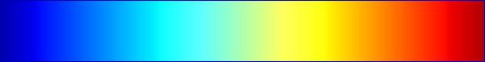
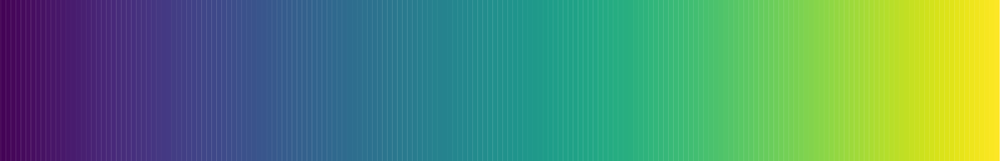
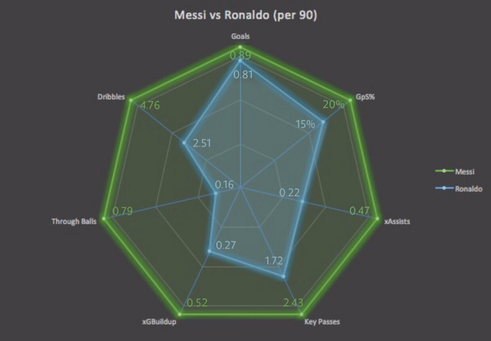

# Outline

- Using color
  - All about colormaps
- Bubble plot
- Facetting
- Parallel Coordinates
- Spider chart

```{r,include=FALSE}
library(reticulate)
use_python('~/anaconda3/bin/python3')
matplotlib<-import('matplotlib')
matplotlib$use("Agg",force=TRUE)
knitr::opts_chunk$set(fig.align='center',echo=FALSE,message = F,warning = F)
```

---


# Motivation

- Suppose we want to investigate three variables
- Whenever we find a relationship between two variables, it is worthwhile asking whether a third variable may be driving that relationship.
- For instance suppose there is a relationship between taxi fare and pickup Borough, perhaps this can be explained by distance.

```{python}
import pandas as pd
import matplotlib.pyplot as plt
import seaborn as sns
import numpy as np
taxisdat = sns.load_dataset('taxis')
diam = sns.load_dataset('diamonds')
```

---

# Boxplot

```{python, out.width='50%'}
sns.boxplot(data = taxisdat, y='fare', x = 'pickup_borough')
```

Manhattan has lower fares

---

# What about distance...

```{python, out.width='50%'}
sns.scatterplot(data = taxisdat, y='fare', x = 'distance')
```

Fare also depends on distance.

---

# Plots in 3D

- Initial reaction may be a 3D plot
- This can be done in Python
- It is very difficult to perceive depth when plot is on a flat screen.
- Being able to rotate the plot helps to some extent
- Still not ideal.

---

# Scatter in 3D

```{python, out.width='50%'}
fig = plt.figure()
ax = fig.add_subplot(projection = '3d')
ax.scatter(taxisdat['fare'],taxisdat['tip'],taxisdat['distance'])
plt.show()
```

---

# Interactive Scatterplot

```{python, echo=T}
import plotly.express as px
fig = px.scatter_3d(taxisdat, x='fare', y='tip', z='distance')
fig.write_html('int3d.html')
```

This code will save plot to a html file that can be opened with any browser.

---

# Interactive Scatterplot

<iframe src="int3d.html" title="3D plot" width="700" height="500"></iframe>

---

class: middle, center, inverse

# Using color

---

# Fare v distance v tip

```{python, out.width='50%'}
sns.scatterplot(data = taxisdat, y='fare', x = 'distance', hue='tip')
```

---

# Fare v distance v borough

```{python, out.width='50%'}
sns.scatterplot(data = taxisdat, y='fare', x = 'distance', hue='pickup_borough')
```

---

# Adding color

- The outliers with small distance, high fare also had higher tips.
  - Perhaps for these trips the taxi driver did something exceptional.
- The outliers at top right mostly Queens.
  - This supports the idea than Manhattan has low fares realtive to Queens due to the fact that trips in Manhattan are shorter.
- Nont definitive causal explanations, but color allows for a richer exploratory understanding of data.

---

# Colormaps

- There are four types of colormaps
  - Sequential
  - Diverging
  - Cyclic
  - Qualitative
- Following discussion based on [Matplotlib documentation](https://matplotlib.org/stable/tutorials/colors/colormaps.html).

---

# Sequential

- For most ordinal or numeric variables we use a *sequential* colormap which should be
  - Perceptually uniform
  - Large range
  - Work when printed in black and white
  - Accessible to colorblind people
  - Colorful and pretty
- The *viridis* colormap (matplotlib default) was developed with these criteria in mind

---

# Jet v Viridis

A popular palette is jet.

```{r}

```

A better palette (by the above criteria) is viridis

```{r}

```

---

# Problems with jet

- Colors close to one another should be similar.
- On jet, in some parts the color changes dramatically over a small range.
- Also colorblind people (about 8% of the population) can have difficulty with the red colors in jet.
- For more on this see <a href="https://www.youtube.com/watch?list=PLYx7XA2nY5Gcpabmu61kKcToLz0FapmHu&v=xAoljeRJ3lU"> this talk</a> by the creators of viridis.

---

# Jet Colormap

```{r}
knitr::include_graphics('img/mona-lisa-rainbow.png',dpi = 100)
```


---

#Viridis colormap

```{r}
knitr::include_graphics('img/mona-lisa-gradient.png',dpi = 100)
```

---

#Colorblindness

.pull-left[ Not colorblind]
.pull-right[ Deuteropia]

---

# Divergent colormaps

- Central point (usually white or a light color).
- Different colors to the left and right.
- Colors become darker for more extreme values.
- Well suited to data that can be positive or negative (e.g. profit/loss, returns, growth, trade balances).

---

# World Bank Data

- Will data sourced from World Bank on European and Central Asian countries in 2015. There are three variables
  - GDP growth
  - Net trade
  - Current account balance

---

# Plot

```{python, out.width='50%',echo=T}
wb = pd.read_csv('../data/worldbank.csv', na_values = '..')
sns.scatterplot(data = wb, hue='Current Account', y = 'Net Trade', x='GDP growth', palette = 'RdBu')
```

---

# Cyclical

- As the name implies a cyclical colormap 'wraps' back around on itself.
- It is useful for displaying data about angles (e.g wind direction) or calendar effects
- The next slide shows taxi fare against distance with day of week mapped to color.
- We will cover code when we discuss dealing with time and date objects next week.

---

# Cyclical colormap

```{python, out.width='50%'}
taxisdat['pickup_dow'] =  pd.to_datetime(taxisdat['pickup']).dt.dayofweek
fig, ax = plt.subplots()
cmap = sns.color_palette('twilight', as_cmap = True)
s = ax.scatter(x = taxisdat['distance'], y = taxisdat['fare'], c=taxisdat['pickup_dow'], cmap=cmap)
cbar = fig.colorbar(mappable=s, ax=ax)
cbar.set_ticks(np.arange(6)+0.5)
cbar.set_ticklabels(['Mon','Tue','Wed','Thu','Fri','Sat','Sun'])
plt.show()
```

---

# Qualitative Colormap

- Used for nominal variables
- Ideal colors to be very different (especially those adjacent on legend)
- Avoid reds and greens to make as colorblind friendly as possible.
- These is a subtle difference between the default qualitative scheme in Seaborn and the colorblind version.

---

# Default

```{python, out.width='50%'}
sns.scatterplot(data = taxisdat, y='fare', x = 'distance', hue='pickup_borough')
```

---

# Colorblind Pallette

```{python, out.width='50%'}
sns.scatterplot(data = taxisdat, y='fare', x = 'distance', hue='pickup_borough', palette = 'colorblind')
```

---


class: middle, center, inverse

# Size and shape

---

# More variables

- What if we want to include information about a fourth or fifth variable?
- We can map a variable to the 
  - Size of the point (bubble plot)
  - Shape of the point
  - Use text
- We can see some examples

---

# Bubble plot

```{python,echo=T, out.width='50%'}
sns.scatterplot(data = taxisdat, y='fare', x = 'distance', hue='pickup_borough', size = 'tip',  palette = 'colorblind')
```

---

# Point shapes

```{python, echo=T,out.width='50%'}
sns.scatterplot(data = taxisdat, y='fare', x = 'distance', hue='pickup_borough', size = 'tip', style = 'payment',  palette = 'colorblind')
```
---

# Gapminder

- A famous example of a bubble chart is Hans Rosling's [gapminder presentation](https://www.youtube.com/watch?v=jbkSRLYSojo)..

```{r}
knitr::include_graphics('img/gapminder.jpeg',dpi = 50)
```


---

# Facetting

- Notice that bubble plots using many different colors and marker shapes can be overly confusing.
- Often it is clearer to use simpler plots, but more plots
- This is known as facetting
- We can facet with one variable or with two (across rows and columns).

---

# Example

```{python, echo=T,out.width='50%'}
g = sns.FacetGrid(taxisdat, col="payment",  row="color")
g.map_dataframe(sns.scatterplot, y = "fare", x = "distance")
```
---

# Facetting

- Facetting can show roughly which categories have the most observations.
- Can show categories with most outliers.
- Can show us if and how a relationship between variables can depend on a nominal variable (although not in the previous plot).

---

# Facetting by a single variable

```{python,echo=T, out.width='50%'}
g = sns.FacetGrid(taxisdat, col="pickup_borough")
g.map_dataframe(sns.scatterplot, y = "fare", x = "distance")
```
---


# Facetting with wrap

```{python, echo=T,out.width='50%'}
g = sns.FacetGrid(taxisdat, col="pickup_borough", col_wrap = 2)
g.map_dataframe(sns.scatterplot, y = "fare", x = "distance")
```
---

# Other plots

```{python,echo=T, out.width='50%'}
g = sns.FacetGrid(taxisdat, col="pickup_borough", col_wrap = 2)
g.map_dataframe(sns.histplot, x = "distance")
```


---

# A warning

- Even if you can display many variables on one plot that does not always mean you SHOULD do this.
- If too many variables are shown it becomes too difficult for the viewer to decode any information.
- Complicated plots can be a useful as a step to work out some interesting features in the data.
- Then simplify your plot to tell a story

---

# Too complicated

```{python, out.width='50%'}
g = sns.FacetGrid(taxisdat, col="pickup_borough", row="dropoff_borough")
g.map_dataframe(sns.scatterplot, y = "fare", x = "distance", hue = "payment", size="tip", style = "color")
```


---

# Pair plots

- Combines scatter plots with histograms or KDEs
- Can also use color.
- The `pairplot` function has an easy interface, but for more flexibility use 'PairGrid' 

---

# Pair plots

```{python,echo=T, out.width='50%'}
sns.pairplot(taxisdat[['distance','fare','tip','tolls','total','payment']],hue='payment')
```


---

# Be careful

- Pair plots themselves often contain too much information
- In the previous example we may focus on specific things such as
  - That credit card payments are more right skewed than cash payments
  - That tolls concentrate around two main values
  - There is no tip for cash payments
- Other plots could then be used to highlight these insights.

---

class: middle, center, inverse

# A few more plots

---

#Parallel coordinates

- The parallel coordinates plot mainly works for numeric data
- Each variable is standardised so they can be plotted on the same vertical axis.
- The variables are displayed horizontally.
- Color can be used to show a nominal variable.
- Implementation in plotly

---

# Wholesale data

- For this example we will use a different dataset.
- Six numerical variables indicating spending in a different product categories (milk, frozen, detergents, etc.)
- Two categorical variables
  - Region (one of three regions in Portugal)
  - Channel (client is either retail or hotel/restaurant/cafe)
-  Data made available by M. Cardoso at [UC Irvine Machine Learning repository](https://archive.ics.uci.edu/ml/datasets/Wholesale+customers)

---

# Wholesale data

```{python}
ws = pd.read_csv('../data/wholesale.csv')
ws
```

---

# Parallel coordinates

```{python, echo=T,  out.width='70%'}
import plotly.express as px
fig = px.parallel_coordinates(ws, color="Channel",
                              dimensions=['Fresh', 'Milk', 'Grocery',
                                          'Frozen','Detergents_Paper', 'Delicassen'])
fig.write_html('parcor.html')
```

---

# Parallel Coordinates

<iframe src="parcor.html" title="Parallel Coordinates" width="700" height="500"></iframe>


---

# Spider/radar chart

- Imagine we take a parallel coordinates plot and wrap it around a circle.
- This gives a spider or radar plot.
- The spider plot is best used for comparing two or three observations across multiple variables.

---

# A fun example



Courtesy of twitter user BayernLM10

---

# Other uses

- Comparing between two or three observations is surprisingly common
  - Summary statistics across a small number of groups
  - Comparing two firms/ products e.g. Apple v Samsung 
  - Comparing the features of two investments.
- Can do these using plotly.
  

---

# Plotly code

```{python, echo=T}

import plotly.graph_objects as go
categories = ['Price (1000$)', 'Weight (kg)', 'Display (in)','USB Ports','Runtime(hrs)', 'RAM(GB)', 'Storage(100GB)']
fig = go.Figure()
fig.add_trace(go.Scatterpolar(
      r=[3.997,2.15, 16.2, 3, 14, 16, 10.24],
      theta=categories,
      fill='toself',
      name='Pro'
))

```

---

# More Plotly code

```{python, echo=T}
fig.add_trace(go.Scatterpolar(
      r=[1.397,1.29, 13.3, 2, 15, 8, 2.56],
      theta=categories,
      fill='toself',
      name='Air'
))
fig.update_layout(
  polar=dict(
    radialaxis=dict(
      visible=True,
      range=[0, 17]
    )),
  showlegend=True
)

fig.write_html('radar.html')

```

---


# Radar plot

<iframe src="radar.html" title="Parallel Coordinates" width="700" height="500"></iframe>


---


# Radar plot

- The plotly code allows you to toggle each product on an off allowing for more comparisons.
- One problem is that it does not easily handle different scales of measurement for each variable.
- You could standardise between 0 and 1 where these limits imply some minimum and maximum value.
- Future versions of plotly should make this rescaling automatic.

---

class: middle, center, inverse

# Wrap-up

---

# Conclusions

- There are several ways to show multiple variables on a plot.
  - Color
  - Size/shape
  - Facetting
- Do not generate complicated plots for the sake of it. Always look for a story.

---

class: middle, center, inverse

# Questions
