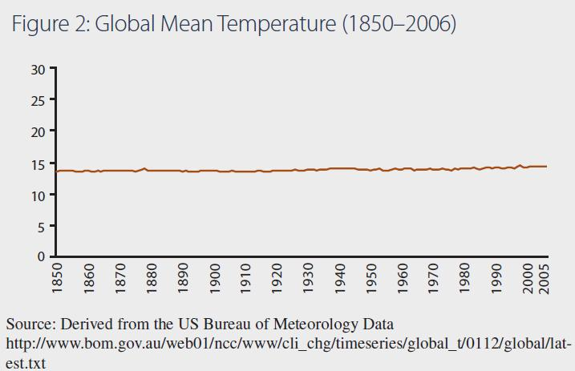
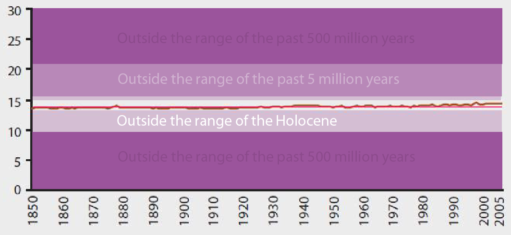
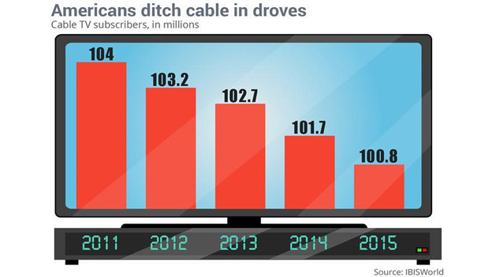
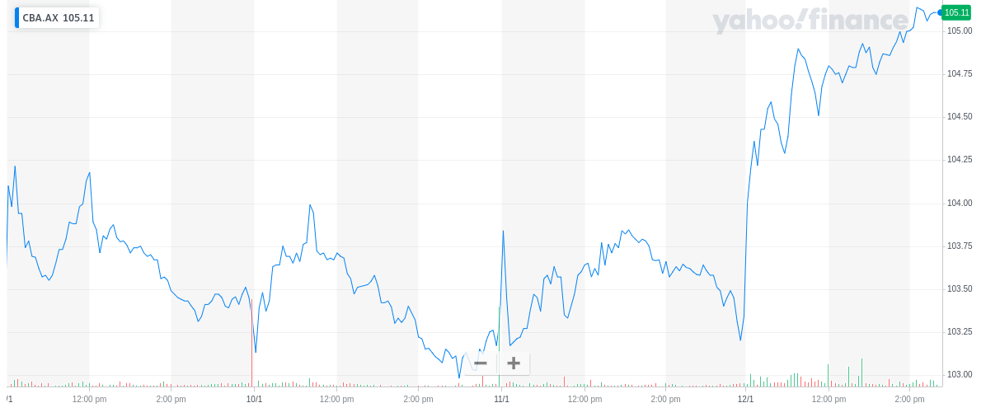
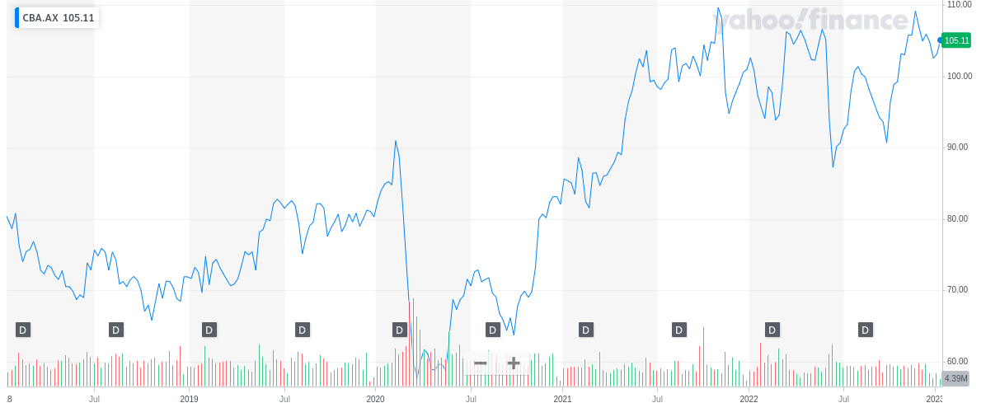
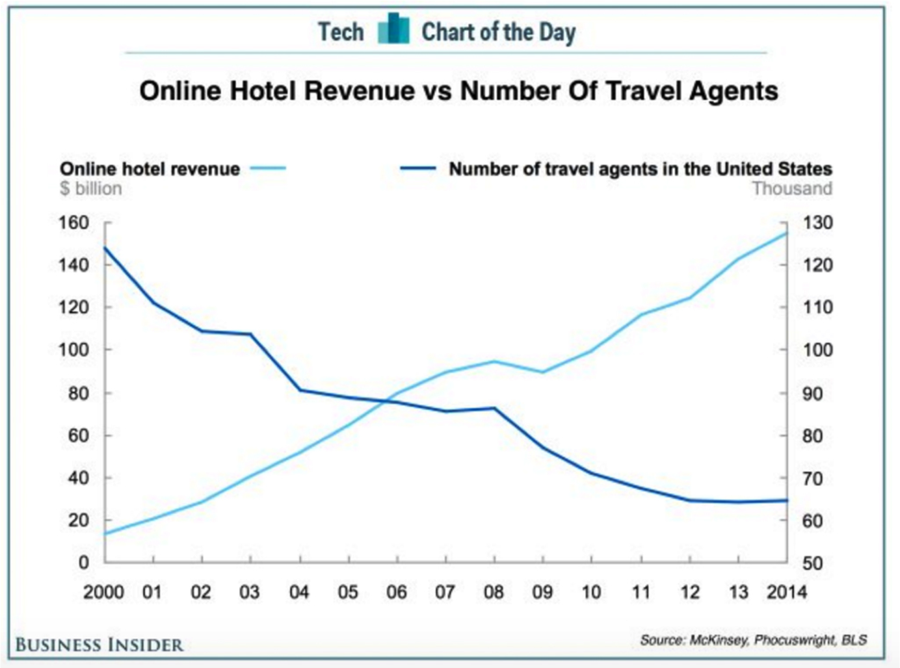

# Outline

- Lineplots
  - Time series features
  - Issues with y axis
  - Issues with x axis
- Python stuff
  - Dealing with dates
  - Plotting time series

```{r,include=FALSE}
library(reticulate)
use_python('~/anaconda3/bin/python3')
matplotlib<-import('matplotlib')
matplotlib$use("Agg",force=TRUE)
knitr::opts_chunk$set(fig.align='center',echo=FALSE,message = F,warning = F)
```

---

# Motivation

- Times series are common in business.
- Traditionally time series data in business were measured at low frequency (e.g. yearly, monthly, quarterly)
  - Inflation
  - Yearly sales
- Increasingly high-frequency data (daily, hourly, microsecond) are available.
  - Individual transactions data
- Business data are distinct in that they heavily influenced by calendar effects.


```{python}
import pandas as pd
import matplotlib.pyplot as plt
import seaborn as sns
import numpy as np
import matplotlib.ticker as ticker
import warnings 
warnings.filterwarnings('ignore')
```


---


# The line plot

- The line plot is the most common plot of a time series
- It shows a single variable on the vertical axis against time on the horizontal axis
- Using this plot we can see
  - Trend
  - Seasonal patterns
  - Calendar effects
  - Outliers
  - Volatility clustering
  
---

# Yearly data

```{python, echo=TRUE, out.width='50%'}
hle = sns.load_dataset('healthexp')
hleusa = hle[hle['Country']=='USA']
sns.lineplot(data = hleusa, x='Year', y='Life_Expectancy')

```

---

# Trend

- This is an example of data with a trend.
- Life expectancy goes up over time.
- There is no seasonality (regular repeating pattern).
- There are no cycles (irregular repeating pattern).

---

# Cycles

```{python, echo=TRUE, out.width='50%'}
dj = sns.load_dataset('dowjones')
g = sns.lineplot(data=dj, x = 'Date', y = 'Price')
g.xaxis.set_major_locator(ticker.LinearLocator(6))
plt.show()
```

---

# Trend and Cycle

- As well as trend, the series goes up and down.
- These are known as *cycles*.
- The cycles are irregular
  - Some are longer than others
  - The peaks and troughs are not always the same size and do not grow or shrink in a systematic way.

---

# Seasonality

```{python, out.width='70%'}
flights = sns.load_dataset('flights')
flights["date"] =pd.to_datetime(flights["year"].astype(str)+flights["month"].astype(str), format = '%Y%b')
sns.lineplot(data=flights, x = 'date', y = 'passengers')
```

---

# Seasonality

- The data roughly repeat every 12 periods.
- The pattern is amplified over time (which is in line with the increasing trend of the data).
- For higher frequncy data there may be multiple seasonalities (e.g, day of week and month of year).

---

# Stocks v flows

- So-called *stocks* represent data measured at a single instant of time, *flows* represent changes to a stock over a period of time.
- The amount of money in my bank account is a stock, my spending during the week is a flow.
- This motivates looking at first differences, or percentage changes in data.


---

# Plotting Change 

```{python, echo=T, out.width='50%'}
hleusa['LEChange'] = hleusa["Life_Expectancy"].diff()
sns.lineplot(data = hleusa, x='Year', y='LEChange')
```

---


# Percentage Change 

```{python, echo=T, out.width='50%'}
hleusa['LE%Change'] = hleusa["Life_Expectancy"].pct_change()
sns.lineplot(data = hleusa, x='Year', y='LE%Change')
```

---

# Autocorrelation

- When discussing time series, the concept of *autocorrelation* is important.
- This is the idea that a time series is correlated with its own past values.
- Line plots can indicate whether data are *positively*, correlated, *negatively* correlated or *not* correlated.
- Here are some synthetic examples.

---

# Postively correlated

```{python,out.width='70%'}
T=200
y=np.zeros(T)
epsilon=np.random.normal(0,0.1,T)
for i in range(1,T):
    y[i]=0.8*y[i-1]+ epsilon[i]
fig, ax = plt.subplots()
ax.plot(np.arange(T),y)
```

---


# Negatively correlated

```{python,out.width='70%'}
T=200
y=np.zeros(T)
epsilon=np.random.normal(0,0.1,T)
for i in range(1,T):
    y[i]=-0.8*y[i-1]+ epsilon[i]
fig, ax = plt.subplots()
ax.plot(np.arange(T),y)
```

---


# Not autocorrelated

```{python,out.width='70%'}
T=200
y=np.zeros(T)
epsilon=np.random.normal(0,0.1,T)
for i in range(1,T):
    y[i]=epsilon[i]
fig, ax = plt.subplots()
ax.plot(np.arange(T),y)
```

---

# Inerpreting autocorrelation

- For positively autocorrelated data, there will be *runs* where the series is above or below its mean.
- For negatively autocorrelated data, the series *oscillates* above and below the mean.
- For data with no autocorrelation, the series does not have these patterns.

---

#Scatterplot

- A scatterplot of a variable against its first lag can aso indicate positive autocorrelation
- A scatterplot against other lags can show seasonality
- There are other ways to plot the autocorrelation function that are covered in other courses on time series,

---

#First lag

```{python, echo=T,out.width='50%'}
flights['firstlag']=flights['passengers'].shift()
sns.scatterplot(data=flights, x = 'firstlag', y = 'passengers')
```
---

# Lag twelve

```{python, echo=T,out.width='50%'}
flights['lag12']=flights['passengers'].shift(12)
sns.scatterplot(data=flights, x = 'lag12', y = 'passengers')
```
---

# Volatility clustering

- Sometimes there is no correlation in the mean, but there is correlation in the variance
  - Volatile periods more likely to follow volatile periods
  - Calm periods more likely to follow calm periods
- This can be seen using a line plot
- It is common with financial returns data


---

# Volatility clustering

```{python, echo=TRUE, out.width='50%'}
dj['Returns']=dj['Price'].pct_change()
g = sns.lineplot(data=dj, x = 'Date', y = 'Returns')
g.xaxis.set_major_locator(ticker.LinearLocator(6))
plt.show()
```

---

class: middle, center, inverse

# Issues with axes


---

# Should zero be on y axis?

- Using a wide or narrow y-axis can be used to exaggerate changes in a line plot
- It is often said that zero MUST be included on the y axis
- This depends on *context*
---

# Climate graph



---

# Climate graph



---

# Line v bar

- For a line plot, to decide whether to include zero, think about whether 0 is a sensible value for the y-variable to take.
- Before the Holocene, you could walk from here to Tasmania and North America was under 4km of ice.
- Note that for bar plots, it is more natural to interpret length of the bar rather than position on the y axis.
- For bar plots always include zero

---

# Better as line plot




Likely to be misinterpreted.

---

# The x-axis

- Similarly the context of the x-axis is important.
- To understand whether a change is big or small, it is important to look at a suitable range of data.
- The following is an example with stock prices of the Commonwealth Bank of Australia (CBA).
- The following show the price of CBA shares over a five day period and a five year period.

---

# A big change?



---

# Same data for five years



---

# Both axes

- Another way to manipulate interpretations is through the *aspect ratio*.
- The aspect ratio is the ratio of units on the y axis relateive to units on the x axis.
- By resizing a plot, features of the time series may be exaggerated (either intentionally or unintentionally).

---

# Wide 

```{python, echo=T}
fig, ax = plt.subplots(figsize = (40,4) )
sns.lineplot(data = hleusa, x='Year', y='LEChange')
```

---

# Long

```{python, echo=T}
fig, ax = plt.subplots(figsize = (3,5) )
sns.lineplot(data = hleusa, x='Year', y='LEChange')
```

---

# Banking to 45

- As a rough guide, consider lines making up a line plot.
- The average angle of these should be about 45 degrees
- Good software packages will do this by default.
- If you resize an image things may change.
- Always look at the axes of a line plot!

---

# Dual y axes



---

# Problems

- Natural to look at and interpret 'crossing points'
- Crossing point nearly always meaningless;
  - Arbitrarily defined by changing y axis,
  - Could be different if different units are used.
- Put multiple lines on a lineplot ONLY when all variables measured in same units.

---

class: middle, center, inverse

# Dealing with dates

---

# Date type in Python

The `datetime` module in Python provides a data type specifically for dealing with dates and times. 

``` {python, echo=T}
import datetime
x=datetime.datetime.now()
y=datetime.datetime(2008, 3, 16)
print(x)
print(y)
```

---

# Intervals

A `timedelta` is the difference between two dates

``` {python, echo=T}
print(x-y)
```

An interval can be added to a date

``` {python, echo=T}
print(y)
print(y+datetime.timedelta(days=10))
```

---

# Datasets

- We will look at two datasets
  - The taxis data set from seaborn
  - A dataset  from the Australian Energy Market Operator of electricity demand in thirty minute intervals for five regions of Australia on the 18th-24th September 2022.

---

# Reading in data

``` {python, echo=T}
import pandas as pd
elec = pd.read_csv('../data/electricity.csv')
elec
```

---

# Converting to date

Dates may not be read in as dates

``` {python, echo=T}
elec.dtypes
```

Can convert using `to_datetime`

``` {python, echo=T}
elec['INTERVAL_DATETIME'] = pd.to_datetime(elec['INTERVAL_DATETIME'])
elec.dtypes
```

---

# Conversion

Convert dates to strings with formats [ here](https://docs.python.org/3/library/datetime.html#strftime-and-strptime-format-codes)

``` {python, echo=T}
datetime.datetime.strftime(y,'%a %d-%B-%Y')
datetime.datetime.strftime(y,'%B %d, %y')
```

And convert back

``` {python, echo=T}
print(datetime.datetime.strptime('December 10, 22','%B %d, %y'))
```

---


class: middle, center, inverse

# More Python plotting

---


# NSW electricity demand

```{python, echo=T, out.width='50%'}
fig, ax = plt.subplots()
g = sns.lineplot(data = elec[elec['REGIONID']=='NSW1'],x='INTERVAL_DATETIME', y = 'OPERATIONAL_DEMAND')
g.xaxis.set_major_locator(ticker.LinearLocator(6))
plt.show()
```

---

# What do we see?

- Some seasonality
  - Reflects patterns of usage throughout the day
- No upwards or downwards trend
  - Make sense since data is only measured over a week
- Can we visualise differently?

---

# Seasonal plot

```{python, echo=T, out.width='45%'}
elec['TIME']=elec['INTERVAL_DATETIME'].dt.strftime('%H:%M') 
elec['DAY']=elec['INTERVAL_DATETIME'].dt.strftime('%a %d-%b') 
g = sns.lineplot(data = elec[elec['REGIONID']=='NSW1'],x='TIME', y = 'OPERATIONAL_DEMAND', hue='DAY') 
g.xaxis.set_major_locator(ticker.LinearLocator(8))
plt.show()
```

---

# What do we see?

- Two peaks
  - Small one in morning
  - Larger one in evening
- Why no early peak on Sunday?
- Why is there a small afternoon peak on the Saturday?

---

# An example with taxi data

- The taxi data contains event data
- We can construct a daily series of number of taxi trips
- This requires some data preparation and conversion between datetimes and dates

---

# Data preparation

```{python, echo=T, out.width='50%'}

taxisdat = sns.load_dataset('taxis')
taxisdat['timestamp'] = pd.to_datetime(taxisdat['pickup'])
taxisdat['date'] = taxisdat['timestamp'].dt.strftime('%Y/%m/%d')
taxists = taxisdat.groupby('date').size().reset_index(name='trips')
taxists['date'] = pd.to_datetime(taxists['date'])
taxists
```

---

# Lineplot

```{python, echo=T, out.width='50%'}
g = sns.lineplot(data = taxists, x='date', y='trips')
g.xaxis.set_major_locator(ticker.LinearLocator(6))
plt.show()
```

---

# What do you see?

- The very first observation is an outlier
- There is also a weekly pattern
- Don't forget that time series data is like all other data. We can use plots *other* than line plots!

---

# An example


```{python, echo=T, out.width='50%'}

taxisdat['datehour'] = pd.to_datetime(taxisdat['pickup']).dt.strftime('%Y/%m/%d %H')
taxish = taxisdat.groupby('datehour').agg({'fare':'mean','distance':'mean'})
taxish['hour'] = taxish.index.str[-2:].astype(int)
taxish
```

---

# Plot

```{python, echo=T, out.width='50%'}
sns.scatterplot(data = taxish, x = 'distance', y = 'fare', hue = 'hour', palette = 'twilight')

```

---

# Another example

```{python, echo=T, out.width='50%'}

taxisdat['day'] = pd.to_datetime(taxisdat['pickup']).dt.strftime('%a')
sns.kdeplot(data = taxisdat, x='fare', hue='day')
```

---

class: middle, center, inverse

# Wrap-up

---

# Conclusions

- The most common plot for time series is the lineplot
  - Can understand time series patterns such as trends, cycles and seasonality.
  - Can find outliers
  - Can understand autocorrelation properties.
- Important to manipulate dates
  - Can get more creative with visualisations.

---

class: middle, center, inverse

# Questions
