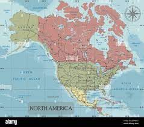
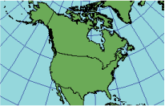
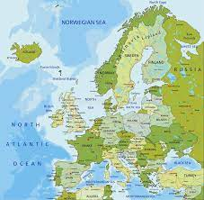
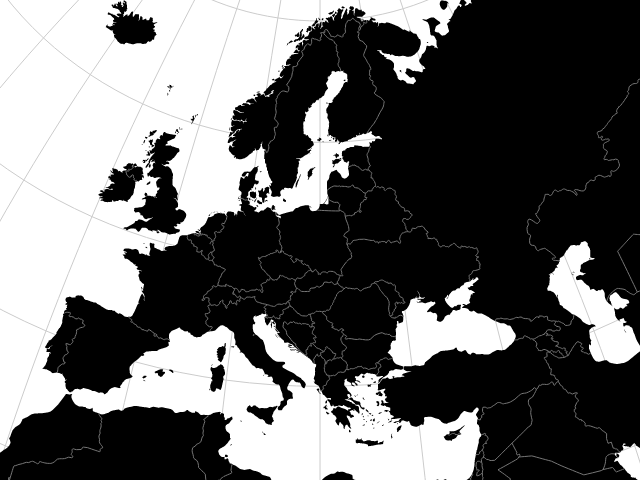
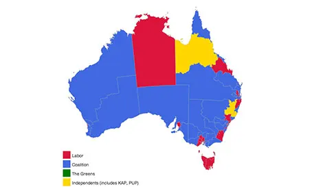
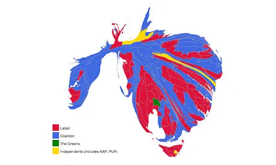
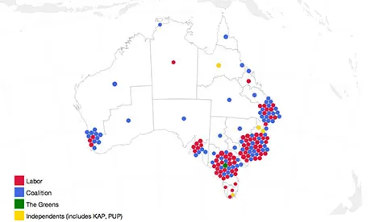

# Outline

- Choropleth

```{r,include=FALSE}
library(reticulate)
#use_virtualenv('~/anaconda3/envs/geo_env')
use_python('~/anaconda3/envs/geo_env/bin/python3')
matplotlib<-import('matplotlib')
matplotlib$use("Agg",force=TRUE)
knitr::opts_chunk$set(fig.align='center',echo=FALSE,message = F,warning = F)
```

---

# Motivation

- Many business decisions depend on geospatial data
  - Store locations
  - Investment in real estate
  - Profile customers in different parts of a city
- Geospatial data used in many other applications.

---

# Packages

- There is an entire field known as Geographical Information Systems (GIS) that we learn over an entire course.
- This is a complicated problem that takes is issues with how coordinates are obtained, how they can be projected in different ways, etc.
- We will be using the `geopandas` package.
- This has many dependencies and can be fiddly to install

---

# Virtual Environment

- Installation instructions can be found in the [geopandas page](https://geopandas.org/en/stable/getting_started/install.html).
- Since there can be clashes with dependencies, it is probably easiest to create a virtial environment just for working with geospatial data.
- Go the the instructions on *Creating a new environment*

---

# World map

```{python}
import geopandas as gpd
import geoplot
world = gpd.read_file(
    gpd.datasets.get_path('naturalearth_lowres')
)
geoplot.polyplot(world, geoplot.crs.Mercator())
```

---

# What is a projection?

- The earth is round.
- There are different ways to project a sphere onto a flat screen.
- All create distortion
- The mercator projection (previous slide) makes areas near the poles look bigger.

---

# Robinson Projection

```{python}
geoplot.polyplot(world, geoplot.crs.Robinson())
```

---


# Does this matter?

- For looking at small countries or cities... no
- For large countries near the North pole... yes
- For the North America it is common to use an Albers projection

---

# North America

.pull-left[

]
.pull-right[

]


---


# North America

.pull-left[

]
.pull-right[

]


---

# What about Australia?

- To see we will actually download data for Australia.
- First we need to download a *Shapefile*
- A Shape file is actually multiple files that store all the information about borders.
- We will use the SA4 areas of Australia.
- The shapefiles can be downloaded from the [Australian Bureau of Statistics](https://www.abs.gov.au/statistics/standards/australian-statistical-geography-standard-asgs-edition-3/jul2021-jun2026/access-and-downloads/digital-boundary-files).
- Shapefiles are a standard format used globally.

---

# Read in shapefile

```{python,echo=T}
aus = gpd.read_file('../data/SA4_2021_AUST_SHP_GDA2020')
aus
```

---

# Simplify series

These shapefiles are very detailes making plotting slow so we can simplify them.

```{python,echo=T}
aus.geometry = aus.geometry.simplify(0.001)
```

---

# Australia

```{python,echo=T}
geoplot.polyplot(aus, geoplot.crs.Mercator())
```

---

# Australia

```{python,echo=T}
geoplot.polyplot(aus, geoplot.crs.Robinson())
```

---

# Summary

- The Mercator projection looks OK for Australia
- However we don't simply want to plot maps
- We want to add *data* to these maps.
- This can be done using a choropleth
- We will use data from the Australian Bureau of Statistics on mortgage repayments in Sydney.
- We will merge this with the geopandas data frame


---

class: middle, center, inverse

# Wrap-up

---


# Data

```{python,echo=T}
import pandas as pd
mortgage = pd.read_csv('../data/Mortgage.csv')
mortgage
```

---

#Merge

```{python,echo=T}
import pandas as pd
merged = aus.merge(mortgage, how='right',left_on = 'SA4_NAME21', right_on = 'SA4')

merged
```

---

#Choropleth

```{python,echo=T,out.width='70%'}
merged.plot(column="$5,000 and over", legend=True)
```

---

# A word of caution

- The choropleth on the previous slide uses *spatially extensive* data.
- By this we mean they are raw counts of people that do not take the population of each area into account.
- It is better to use *spatially intensive* data in a choropleth

---

#Proportion

```{python,echo=T,out.width='70%'}
merged["$5,000+ Percentage"] = 100*merged["$5,000 and over"]/merged["Total"]
merged.plot(column="$5,000+ Percentage", legend=True)
```


---

class: middle, center, inverse

# Making things interactive


---

# Why interactivity?

- Unless you know the location well, it may be hard to tell which regions are which.
- Also urban areas tend to be smaller therefore it helps to be able to zoom in and move around.
- We can also augment the choropleth with individual locations.

---

#Plolty Code

```{python,echo=T,out.width='70%'}
import plotly.express as px
merged.index = merged['SA4']
fig = px.choropleth_mapbox(merged,
geojson=merged.geometry,
locations = merged.index, 
color = "$5,000+ Percentage", 
opacity=0.5, mapbox_style="carto-positron",
zoom = 7, #Zoom in scale
center = {"lat": -33.7, "lon": 150.75})
fig.add_scattermapbox(lat = [-33.89083755569, -33.91648618776671],
lon = [151.18711290919222, 151.23079491201923], 
text = ["The University of Sydney", "UNSW"],
marker_size=6)
fig.write_html('plotly_choropleth.html')
```

---

# Interactive

<iframe src="plotly_choropleth.html" title="Choropleth" width="700" height="500"></iframe>

---

# Summary

- There are a rich range of visualisations that you can create with geographic data.
- However you can generally only look at one variable at one moment of time.
- You can construct multiple choropleths and display together but they can also be difficult to interpret.

---

# Misleading choropleths

- In many countries, the population density is not uniform
- This includes Australia, the US and China where most of the population lives on the coast and well as India and France as other examples with less densely populated regions.
- This commonly leads to misinterpratation of election results.

---

# Australian 2010 election

.pull-left[
- The 2010 election was very close
- However the map on the right suggests the Coalition (blue) was dominant.
- This map shows land but not voters.
]
.pull-right[

]

---

# Two alternatives

.pull-left[

]
.pull-right[

]


---

# Discussion

- The alternative on the left is called a *cartogram*.
  - It can be visually jarring
- The alternative on the right loses precise spatial information.
- All plots and further discussion are from [this article](https://www.theguardian.com/world/datablog/2013/sep/06/better-election-results-map)
- This issue is not restricted to politics, an example on brand choice may suffer from similar issues.

---


class: middle, center, inverse

# A word on heatmaps

---

# Heatmaps

- A choropleth is often called a *heatmap*.
- A heatmap is a similar idea in that areas are shown with different colors. However a heatmap is used to visualise numbers in a matrix.


---


# Data Preparation

```{python,echo=T}
import seaborn as sns
fl = sns.load_dataset('flights')
fltab = fl.pivot(index = 'year', columns = 'month')
fltab

```

---

# Heatmap

```{python,echo=T,out.width='60%'}
import seaborn as sns
sns.heatmap(fltab)

```

---

# Correlation heatmap

- With a moderate number of numerical variables we can compute the correlation of all pairs of variables.
- These can be put into a matrix known as the correlation matrix.
- This can also be shown in a heatmap.
- We will do this some numerical variables from the taxis data

---


# Data preparation

```{python,echo=T}
taxisdat = sns.load_dataset('taxis')
taxisnum = taxisdat[['distance','fare','tip','tolls','total']]
taxiscor = taxisnum.corr()
```

---

# Correlation heatmap

```{python,echo=T,out.width = '60%'}
sns.heatmap(taxiscor)
```

---

# With annotation

```{python,echo=T,out.width = '60%'}
sns.heatmap(taxiscor, annot = True)
```

---

# Heatmaps

- Heatmaps work best when the adjacent rows and columns are related.
- This is why it works well for the flights example.
- For a correlation heatmap, the row and column order is arbitrary.
- It is better than looking at a correlation matrix.
- Something like a pairs plot shows more.

---
class: middle, center, inverse

# Wrap-up

---

# Conclusions

- Spatial data can be used to create valuable visualisations. However
  - Think carefully about how population is distributed in geographic regions
  - Do not neglect other visualisation methods
- Heatmaps are different to choropleths even if these two words a re often confused.
  - Be aware of the strengths and weaknesses of heatmaps.
---

class: middle, center, inverse

# Questions
