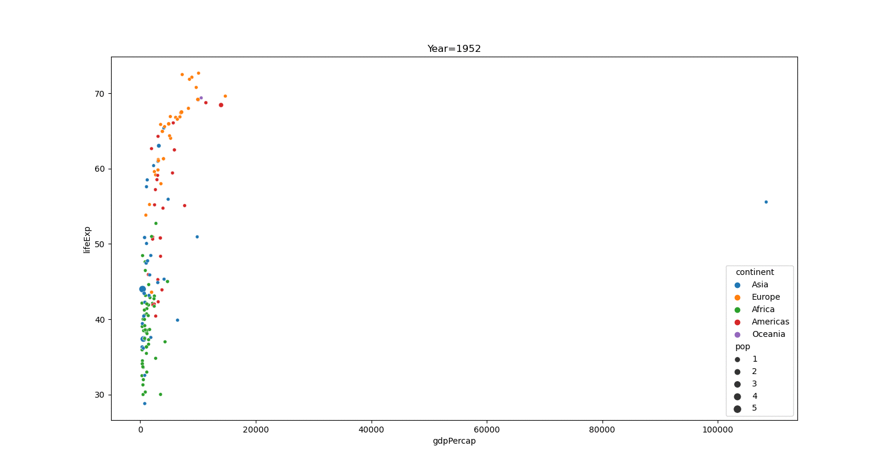

# Outline

- Interactive plots
  - Limited interface
- Dashboards
  - More interaction with user
  - Principles
- Animations

```{r,include=FALSE}
library(reticulate)
use_python('~/anaconda3/bin/python3')
matplotlib<-import('matplotlib')
matplotlib$use("Agg",force=TRUE)
knitr::opts_chunk$set(fig.align='center',echo=FALSE,message = F,warning = F)
```

---


# Motivation

- Interactive data visualization enables users to directly manipulate and explore graphical representations of data. 
- Interactive visualisations have an aspect of human input 
  - Clicking on a button
  - Moving a slider
  - Hovering over a mouse
- Quick response time quick to show updated visual output.

```{python}
import pandas as pd
import matplotlib.pyplot as plt
import seaborn as sns
import numpy as np
```

---

# Packages and data

- We will first use the plotly package
- From this we can load the gapminder data on different mortality rates and economic growth for many countries across time.

```{python,echo=T}
import plotly.express as px
import plotly.data as pld
gm = pld.gapminder()
gm
```


---

# Scatterplot Code

First a scatterplot using data from 2002

```{python,echo=T}
import plotly.express as px
import plotly.data as pld
gm2000 = gm[gm['year']==2002]
fig = px.scatter(
  gm2000, 
  y='lifeExp', 
  x='gdpPercap')
fig.write_html('scatter.html')
```

---

# Scatterplot

<iframe src="scatter.html" title="Scatter" width="700" height="500"></iframe>

---

# What can I do?

- Zoom in to parts of the plot that have a high density of points.
- Hover over each point to see the values of each variable.
- Suppose I want to identify outliers.
  - A static plot would require looking at the data again and writing more code
  - Instead we can control what information is shown when we hover over a point.
  
---

# Code

```{python, echo=T}
fig = px.scatter(
  gm2000, 
  y='lifeExp', 
  x='gdpPercap', 
  hover_data = ['country'])
fig.write_html('scatterhover.html')
```

---

# Plot

<iframe src="scatterhover.html" title="Scatter" width="700" height="500"></iframe>


---


# Code for bubble plot

```{python, echo=T}
fig = px.scatter(
  gm2000, 
  y='lifeExp', 
  x='gdpPercap', 
  size='pop', 
  color= 'continent', 
  hover_data = ['country'], 
  log_x=True, 
  log_y = True)
fig.write_html('scatterbubble.html')
```

---


# Plot

<iframe src="scatterbubble.html" title="Bubble" width="700" height="500"></iframe>


---

# What can I do?

- Can select groups according to continent.
- With a static plot would need to facet.
- If needed facetting is still available in plotly
- For more on plotly see the documentation [here](https://plotly.com/python/)

---

# Code for line plot

```{python, echo=T}
st = pld.stocks()
fig = px.line(
  st, 
  y='FB', 
  x='date'
  )
fig.write_html('line.html')
```

---


# Plot

<iframe src="line.html" title="Line" width="700" height="500"></iframe>

---

# Bokeh

- The other python package useful for interactive visualisation is `bokeh`.
- I will demonstrate a simple scatterplot.
- Bokeh is a litle different to other packages we have used so far.
  - It very customisable.
  - Code can get complicated regading pandas integration (although the `plot_bokeh` library can help..
  - Good for dashboards.

---

# Bokeh

```{python, echo=T}
from bokeh.plotting import figure, output_file, show
output_file("bokehscatter.html")
fig = figure(title = "Bokeh Scatter Graph")
fig.scatter(gm2000['gdpPercap'],gm2000['lifeExp'])
show(fig)
```
---


# Bokeh 

<iframe src="bokehscatter.html" title="Bokeh " width="700" height="500"></iframe>


---

class: middle, center, inverse

# Dashboards

---

# Dashboards

- So far the interactivity we considered was limited.
- The user has no way of changing the visualisation.
- For example in the gapminder data we only showed data for the year 2002.
- What if the user wants to be able to select the year?

---

# Dashboards

- Benefits of Dashboards include 
  - Fast and effective decision-making
  - On demand, accurate and relevant information in line with business priorities
  - Focused identification of problems, inefficiencies or negative trends for immediate action and improved performance

---

# Dashboards

- Generally have three elements
  - Contains multiple graphs.
  - It has interactive elements
  - It is uses streams of data
- If the third condition is not met it is a *static dashboard*.
- We will focus on the second condition

---

# Dashboards

- Dashboards can get complicated, but code will comprise of two parts.
  - The *layout* dicates what the user sees, i.e. how the plots and any interactive elements are arranged.
  - The *callbacks* contains code for creating plots and processing the data depending on the users input.
- To keep things simple we will only include one callback, a dashboard with multiple plots requires multiple callbacks.
---

# Using dashboards

- Put all your code into one script
- Run the script
- Open a browser
- Navigate to 127.0.0.1:8050
  - This is the local server
- Many options exist for hosting and sharing Dash apps online.

---

# Dash code layout

```{python, echo=T, eval=F}
from dash import Dash, dcc, html, Input, Output
import plotly.express as px

app = Dash(__name__)


app.layout = html.Div([
    dcc.Graph(id="scatter-plot"),
    html.P("Select a year:"),
    dcc.Slider(1952,2007,5,
        value = 1952,
        id='year-slider',
        marks={i: '{}'.format(i) for i in range(1952,2007,5)}
    ),
])
```

---

# Dash code layout

```{python, echo=T, eval=F}

@app.callback(
    Output("scatter-plot", "figure"), 
    Input("year-slider", "value"))
def update_plot(year):
    gm = px.data.gapminder() # replace with your own data source
    gmy = gm[gm['year']==year]
    fig =  px.scatter(gmy,
      y='lifeExp',
      x='gdpPercap',
      size='pop', 
      color= 'continent', 
      hover_data = ['country'],
      log_x=True, 
      log_y = True,
      title = 'Health v Wealth across the world in '+str(year)
      )
    return fig
app.run_server(debug=True)
```

---


# More on dashboards

- Many things can be done with dashboards
  - Dash [examples](https://dash.gallery/Portal/)
  - Bokeh [examples](https://docs.bokeh.org/en/latest/docs/gallery.html)
- Underlying both packages is html, css and js code (languages used for internet applications)
- Bokeh 'hides' this a little more.

---

# Avoid

- Having too many plots on a dashboard
- Having dashboards that are fun to play with but are not business focused.
  - Dashboard should lead to actionable decisions.
- Ignoring principles of visualisation.

---

# Bad Dashboard


---

class: middle, center, inverse

# Animation

---

# Animation

- One final trick we will learn is to do animations.
- For example in the gapminder example we can show the plot as a video rather than look at one year at a time.
- This can be done using `matlotlib.animate`
- The idea is similar to a flipbook

---

# Flipbook


---

# Making an animation

- We will create a sequence of images
- These will be like the pages of the flip book.
- These can be created using a function.
- Then `matplotlib.animate` can just loop through creating the pages of the flipbook.
- Can then save as  GIF
  - My example uses the ImageMagick software to create the GIF, this must be installed for following code to work.


---

#Animation

```{python, echo=T}
from matplotlib import animation
fig, ax = plt.subplots(figsize = (15, 8))
def animate(i):
    ax.cla()
    year=1952+i*5
    gmy = gm[gm['year']==year]
    g = sns.scatterplot(data = gmy, y = 'lifeExp',    x='gdpPercap',hue='continent', size = 'pop')
    plt.title("Year="+str(year))

ani = animation.FuncAnimation(fig=fig, func = animate, frames=12,repeat=True)
ani.save('animation.gif',writer='imagemagick', fps=1)
```


---

# Animation



---

class: middle, center, inverse

# Wrap-up

---

# Conclusions

- The purpose of today was to give you a small taste of what is possible with advanced interactive plots.
- Much more can be done, but the coding becomes sophisticated.
- Do not forget that more sophisticated does not mean better.
  - In a written report interactivity cannot be used!
- However interactive plots can be impactful in a presentation.

---

class: middle, center, inverse

# Questions
