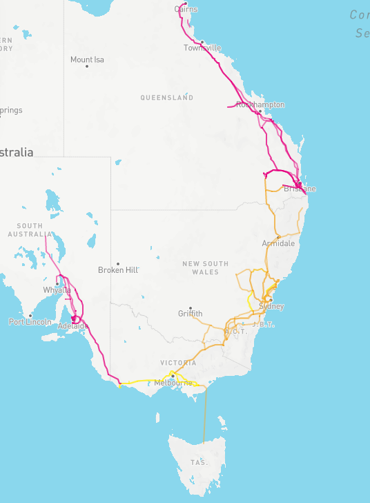
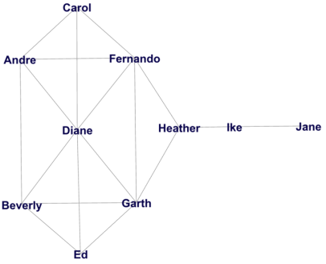
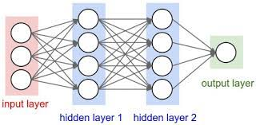

# Outline

- Graph theory
  - Graphs
  - All about edges
  - All about nodes
- Bipartite graphs

```{r,include=FALSE}
library(reticulate)
use_python('~/anaconda3/bin/python3')
matplotlib<-import('matplotlib')
matplotlib$use("Agg",force=TRUE)
knitr::opts_chunk$set(fig.align='center',echo=FALSE,message = F,warning = F)
```

---


# Motivation

- Networks are ubiquitous in business applications
  - Supply chains
  - Social networks
  - International trade
- Networks can be understood and visualised using graph theory.

```{python}
import pandas as pd
import matplotlib.pyplot as plt
import seaborn as sns
import numpy as np
```

---

# Network v Graph

- A *network* is a real system consisting of some entities and the relationships between them.
- A *graph* is an abstract mathematical construct that can describe networks.
- Note that this week we use *graph* with a specific mathematical meaning, and not in the everyday sense of graphs as different visualisations (e.g histograms and scatterplots).

---

class: middle, center, inverse

# Graph theory

---

# Definition

- A graph is made up of two sets
  - A set of vertices $\mathcal{V}$
  - A set of edges $\mathcal{E}$
  - At most one edge connects exactly two vertices
- In some settings, the third condition is relaxed so that a vertex can have an edge with itself and multiple edges can connect the same two vertices

---

# Examples

- In a social network: 
  - Vertices are individuals / users
  - Edges indicate whether two individuals are *friends* on the social network
- In a food delivery app
  - Vertices may be restaurants and suburbs
  - Edges indicate whether a restaurant delivers to a suburb.
  

---

# Simple example

- Four vertices: A, B, C and D
  - Edges from A to B, C and D 
  - Edges from B to A and D 
  - Edges from C to A and D 
  - Edges from D to A, C and D
- This is adapted from the bridges of Königsberg (the first application of graph theory).  
  
  
---

# In Python

- We will use the `networkx` package to deal with graphs and networks.
- We can build a network from a pandas data frame

```{python, echo=T}
import networkx as nx
df = pd.DataFrame({ 'from':['A', 'A', 'A','B','C'], 'to':['B', 'C', 'D','D','D']})
df
```

---

# Drawing graph

```{python, echo=T, out.width = '50%'}

G=nx.from_pandas_edgelist(df, 'from', 'to')
nx.draw(G, with_labels=True)
plt.show()
```


---

# To look nicer

```{python, echo=T, out.width = '50%'}

G=nx.from_pandas_edgelist(df, 'from', 'to')
nx.draw(G, with_labels=True, node_size=2000, font_size=20, width = 6)
plt.show()
```


---

# Why are they different?

- Layout of graphs is determined by algorithms.
- The default algorithm is known as Fruchterman-Reingold.
- To understand must consider two "forces":
  - Think of edges as "springs" with an attractive force to display shorter edges.
  - Think of non-adjacent nodes as repelled by electric forces.


---

# Fruchterman-Reingold

- Initialise nodes in random positions
- Compute both attracting and repelling forces for each node.
- Move all nodes by an amount proportional to net forces.
- Repeat this, each time making the adjustment smaller.


---

# Fruchterman-Reingold

- Due to initial random step, can plot the same plot and get different results.
- To obtain a consistent layout we can
  - Fix the position of some nodes
  - Set the same random seed whenever we draw the graph.
- Usually experimenting with a few different random seeds is satisfactory.


---

# Set seed

```{python, echo=T, out.width = '50%'}

G=nx.from_pandas_edgelist(df, 'from', 'to')
nx.draw(G, with_labels=True, node_size=2000, font_size=20, width = 6, pos=nx.fruchterman_reingold_layout(G,seed=10))
plt.show()
```

---

# Same layout

```{python, echo=T, out.width = '50%'}

G=nx.from_pandas_edgelist(df, 'from', 'to')
nx.draw(G, with_labels=True, node_size=2000, font_size=20, width = 6, pos=nx.fruchterman_reingold_layout(G,seed=10))
plt.show()
```

---

# Adjacency matrix

- The adjacency matrix is defined so that
  - The element $a_{ij}=1$ if two vertices are connected by an edge (they are *adjacent*)
  - The element $a_{ij}=0$ otherwise
- Let's see an example
---

# Graph again

```{python, out.width = '70%'}

G=nx.from_pandas_edgelist(df, 'from', 'to')
nx.draw(G, with_labels=True, node_size=2000, font_size=20, width = 6, pos=nx.fruchterman_reingold_layout(G,seed=10))
plt.show()
```

---

# Adjacency matrix

Adjacency matrix given by

$$\pmb{A} = \begin{pmatrix}0&1&1&1\\1&0&0&1\\1&0&0&1\\1&1&1&0\\\end{pmatrix}$$

---

# As heatmap

```{python, out.width = '70%'}
A = np.matrix([[0,1,1,1],
[1,0,0,1],
[1,0,0,1],
[1,1,1,0]])

sns.heatmap(A, xticklabels = ['A','B','C','D'], yticklabels = ['A','B','C','D'])
```

---

# Complete graphs

- If there are edges between every pair of nodes the graph is *complete* (then $\pmb{A}$ only has ones off diagonal).
- If a subset of vertices has this property this is a called a *clique*. 
- The number of edges divided by the number of edges of a complete graph is a measure of graph *density*.

---

# Complete graph

```{python, out.width = '50%'}
df = pd.DataFrame({ 'from':['A', 'A', 'A','B','B','C'], 'to':['B', 'C', 'D', 'C','D','D']})
G=nx.from_pandas_edgelist(df, 'from', 'to')
nx.draw(G, with_labels=True, node_size=2000, font_size=20, width = 6)
plt.show()
```

---

# Clique

A,B,C and D form a clique

```{python, out.width = '50%'}
df = pd.DataFrame({ 'from':['A', 'A', 'A','B','B','C','D'], 'to':['B', 'C', 'D', 'C','D','D','E']})
G=nx.from_pandas_edgelist(df, 'from', 'to')
nx.draw(G, with_labels=True, node_size=2000, font_size=20, width = 6)
plt.show()
```

What is the density of this graph?

---


# Larger networks

- The Fruchterman Reingold method works well for graphs with hundreds of nodes.
- For larger graphs different algorithms have been developed.
- This exploits the fact that larger graphs have low density.
- Break up networks into smaller smaller subgraphs/cliques.
- Larger graphs benefit from interactivity which is possible (but challenging) using [plotly](https://plotly.com/python/network-graphs/).

---

# Arc plot

An alternative is the [arc plot](https://d3-graph-gallery.com/arc.html).


---

class: inverse, center, middle

# Paths and edges

---

# Paths

- If connect one vertex to another without visting the same vertex twice, this is known as a *path*.
- Finding the *shortest path* has many applications.
- This gives a measure of *distance* between nodes
- We can visualise paths as well


---

# Paths

Path from A to E

```{python,out.width = '50%'}
df = pd.DataFrame({ 'from':['A', 'A', 'A','B','B','C','D'], 'to':['B', 'C', 'D', 'C','D','D','E']})
G=nx.from_pandas_edgelist(df, 'from', 'to')
nx.draw(G, with_labels=True, node_size=2000, font_size=20, width = 6,pos=nx.fruchterman_reingold_layout(G,seed=10))
plt.show()
```

---


#Paths

Path from A to E

```{python, out.width = '50%'}
df = pd.DataFrame({ 'from':['A', 'A', 'A','B','B','C','D'], 'to':['B', 'C', 'D', 'C','D','D','E']})
G=nx.from_pandas_edgelist(df, 'from', 'to')
nx.draw(G, with_labels=True, node_size=2000, font_size=20, width = 6, edge_color = [1,0,0,0,1,0,1],pos=nx.fruchterman_reingold_layout(G,seed=10))
plt.show()
```

---

#Paths

Another path from A to E

```{python, out.width = '50%'}
df = pd.DataFrame({ 'from':['A', 'A', 'A','B','B','C','D'], 'to':['B', 'C', 'D', 'C','D','D','E']})
G=nx.from_pandas_edgelist(df, 'from', 'to')
nx.draw(G, with_labels=True, node_size=2000, font_size=20, width = 6, edge_color = [0,0,1,0,0,0,1], pos=nx.fruchterman_reingold_layout(G,seed=10))
plt.show()
```

---


#Paths

Not a path

```{python, out.width = '50%'}
df = pd.DataFrame({ 'from':['A', 'A', 'A','B','B','C','D'], 'to':['B', 'C', 'D', 'C','D','D','E']})
G=nx.from_pandas_edgelist(df, 'from', 'to')
nx.draw(G, with_labels=True, node_size=2000, font_size=20, width = 6, edge_color = [1,1,1,1,0,0,1], pos=nx.fruchterman_reingold_layout(G,seed=10))
plt.show()
```

---

# Hamiltonian Path

- Hamiltonian paths pass through every vertex exactly once.
- Finding the shortest Hamiltonian path has many applications in logisitics.
- This is similar to the Travelling Salesman problem.
- In the TSP however, you must return to the first node

---

#Paths

Hamiltonian Path

```{python, out.width = '50%'}
df = pd.DataFrame({ 'from':['A', 'A', 'A','B','B','C','D'], 'to':['B', 'C', 'D', 'C','D','D','E']})
G=nx.from_pandas_edgelist(df, 'from', 'to')
nx.draw(G, with_labels=True, node_size=2000, font_size=20, width = 6, edge_color = [1,1,0,0,0,1,1], pos=nx.fruchterman_reingold_layout(G, seed=10))
plt.show()
```

---

#Paths

Another Hamiltonian Path

```{python, out.width = '50%'}
df = pd.DataFrame({ 'from':['A', 'A', 'A','B','B','C','D'], 'to':['B', 'C', 'D', 'C','D','D','E']})
G=nx.from_pandas_edgelist(df, 'from', 'to')
nx.draw(G, with_labels=True, node_size=2000, font_size=20, width = 6, edge_color = [1,0,0,1,0,1,1], pos=nx.fruchterman_reingold_layout(G, seed=10))
plt.show()
```

---

# Connected graphs

- If there is a path between all pairs of vertices then a graph is said to be *connected*.
- Otherwise it is *disconnected*
- If a graph is disconnected we usually study its constiuent parts in isolation.

---

# Disconnected graph

```{python, out.width = '50%'}
df = pd.DataFrame({ 'from':['A', 'A', 'B','C','E'], 'to':['B', 'C',  'D','B','F']})
G=nx.from_pandas_edgelist(df, 'from', 'to')
nx.draw(G, with_labels=True, node_size=2000, font_size=20, width = 6)
plt.show()
```

---

# A real example

.pull-left[
- The Australian National Electricy Market (NEM) was formed by connecting 5 state markets
- The are a limited number of interconnections between states.
]
.pull-right[


]


---

# As a graph

```{python, echo=T, out.width = '50%'}
nem = pd.DataFrame({ 'from':['QLD', 'NSW', 'VIC','VIC'], 'to':['NSW', 'VIC', 'SA','TAS']})
G=nx.from_pandas_edgelist(nem, 'from', 'to')
nx.draw(G, with_labels=True, node_size=2000, font_size=20, width = 6, pos= nx.fruchterman_reingold_layout(G, seed=20))
plt.show()
```

---

# Weighted Graph

- We may assign a number to each edge known as a *weight*.
- This is called a *weighted graph*
- In a network the weight often measures some distance between locations.
- Mathematically the ones in the adjacency matrix become any positive number instead.
- Therefore weights can represent capacities or flows along a network instead.
---

# Visualising weighted graphs

- When drawing graphs the edge weight can be shown using the thickness of the line representing each edge.
- In this way, we can also represent any data about our edges.
- In the following, we will consider the NEM example and represent the capacity of each interconnector.
- Note that we potentially lose the interpretation of distance when we assign arbitrary data to the weights.
---

# Weighted NEM graph


```{python, echo=T, out.width = '50%'}
nem = pd.DataFrame({ 'from':['QLD', 'NSW', 'VIC','VIC'], 'to':['NSW', 'VIC', 'SA','TAS'], 
'capacity':[1380,1770,495, 500]})
nx.draw(G, with_labels=True, node_size=2000, font_size=20, width = nem['capacity']/500, pos= nx.fruchterman_reingold_layout(G, seed=20))
plt.show()
```

---

# Weighted NEM graph


```{python,  echo=T, out.width = '50%'}
nx.draw(G, with_labels=True, node_size=2000, font_size=20, width = 6, edge_color = nem['capacity']/500, pos= nx.fruchterman_reingold_layout(G, seed=20))
plt.show()
```


---

# Directed graph

- Another generalisation of graphs allows for edges to have a direction.
- An edge from A to B is different from an edge from B to A
- This is usually visualised using an arrow on the edge 

---

# NEM data

- Consider an application for the NEM data.
- Instead of capacity of the interconnectors consider the flow of electricity across different regions
- These data are based on a single snapshot on time and sourced from the NEM.
---

# Construct graph

```{python, echo=T, out.width='50%'}
nem = pd.DataFrame({ 
  'from':['QLD', 'NSW', 'SA','VIC'], 
  'to':['NSW', 'VIC', 'VIC','TAS'],
  'flow':[332, 644, 339, 308]})
Gd=nx.from_pandas_edgelist(
  nem,
  'from', 
  'to', 
  create_using=nx.DiGraph()
  )
```

---

# Directed graph

```{python, echo=T, out.width='50%'}
nx.draw(Gd, arrows=True, with_labels=True, node_size=2000, font_size=20, width = nem['flow']/100, pos= nx.fruchterman_reingold_layout(Gd, seed=20))
plt.show()
```

---

# Other examples

- Directed graphs can be used in social networks where one user *follows* another.
- Road systems with one way roads.
- Directed graphs also used to describe causal relationships

---

# Purchase decision

- Consider the following variables 
  - Age of customer
  - Advertising exposure
  - Price
  - Buy a product
  
---

# Purchase decision

- Suppose age does not directly influence the decision to purchase.
- However, age may influence the exposure to the advertising.
  - Advertising may be on legacy media more likely to be seen by older individuals.
- Price directly influence decision to buy.
---

# As a graph

```{python, echo=F, out.width='70%'}
buy = pd.DataFrame({ 'from':['AGE', 'PRICE', 'ADV'], 'to':['ADV', 'BUY', 'BUY']})
buyg = nx.from_pandas_edgelist(buy, 'from', 'to', create_using=nx.DiGraph())
nx.draw(buyg, arrows=True, with_labels=True, node_size=2000, font_size=20, width=3, pos= nx.fruchterman_reingold_layout(buyg, seed=20))
plt.show()
```

---

# Directed Graphs and models

- Directed graphs can be used to build statistical models.
- These are known as *Bayesian belief nets*
- One condition is that the graphs cannot contain cycles.
- The statistical model estimates conditional probabilities of some nodes conditional on other nodes.
- For example we may be able to estimate the probability that a 25 year old customer purchases a product, given the price is reduced. 
---

class: middle, center, inverse

# All about vertices

---

# Characterising vertices

- The *degree* of a vertex is the number of nodes it shares an edge with.
- The *eccentricity* of a vertex is the greatest distance to any other node.
- The *diameter* is the largest *eccentricity* over the whole graph


---

# Example



---

# Questions

- This is known as Krackhardt's kite. Answer the following
  - What is the degree of Andre?
  - What is the degree of Ike? 
  - What is the eccentricity of Fernando?
  - What is the diameter of the graph?

---

# Graph centrality

- Graph centrality is aimed at determining the most 'important' vertex in the graph.
- In a social network this can be used to identify 'influencers'.
- There are multiple ways to understand centrality and Krackhardt's kite demonstrates the strengths and weaknesses of each method.

---

# Degree Centrality

.pull-left[

]

.pull-right[
- One measure is to find the vertex with the highest degree.
- This is Diane with a degree of 6.
]

---

# Closeness Centrality

Closeness centrality is the inverse of all shortest paths

$$c_j = \frac{n-1}{\sum_{i\neq j} d_{i,j}}$$
where $d_{i,j}$ is the length of the shortest path from vertex $i$ to vertex $j$ and $n$ is the number of vertices.

---

# Closeness Centrality of Jane

- Jane is a distance of
  - 1 from Ike
  - 2 from Heather
  - 3 from Fernando and Garth
  - 4 from everyone else
- Closeness centrality is $9/(1+2+2\times 3+5\times4)\approx 0.3103$

---

# Closeness centrality


.pull-left[

]

.pull-right[
- Fernando and Garth have the highest closeness centrality
- They are in the best position to monitor information flow on the network.
]

---

# Betweeness centrality

- Betweeness centrality gives a measure of how critical a node is in connecting different parts of the graph.
- For a vertex $j$
  - Take a pair of nodes $i,l\neq j$
  - Compute all *shortest paths* between these nodes
  - Find the proportion of these shortest paths that include node $j$
  - Add up over all possible pairs $i,l$

---

# An example

- Compute betweeness centrality for Fernando.
  - Shortest paths between Andre and Ed. None of these include Fernando (add 0/2)
  - Shortest paths between Carol and Heather. Only one that goes through Fernando (add 1/1)
  - Shortest paths from Diane to Ike. There are two and one goes through Fernando (add 1/2)
- You would need to do these for all pairs and add, i.e. $(0/2)+(1/1)+(1/2)$

---

# Betweeness centrality


.pull-left[

]

.pull-right[
- Heather has the highest betweeness centrality
- She is in a position to control information along the network.
]


---

# Eigenvalue Centrality

- We will conclude with the notion of *Eigenvalue Centrality*. The following must hold for all $j$. 

$$c_j=\frac{1}{\lambda}\sum_{i\neq j} a_{ij} c_i$$

I am important if my friends are important and my friends are important if I am important 


---

# Solution

Must find some value $\pmb{c}$ such that

$$\pmb{A}\pmb{c}=\lambda\pmb{c}$$
This is a famous problem in math known as the eigenvalue problem.

There will in general be multiple solutions. However only one solution satisfies the condition that $\lambda$ and all centrality measures are positive.

---

# Eigenvalue centrality

- Perhaps the most famous application of this is the PageRank algorithm.
- This was the original algorithm used on google search.
- The idea was to use hyperlinks between websites to construct a network.
- PageRank was used to order the importance of websites.
- If you had learnt about this 25 years ago you could be billionaires (sorry!)

---

class: middle, center, inverse

# Bipartite Graph

---

# Bipartite Graph

- A *bipartite graph* is a special graph where the vertices can be separated into two sets $\mathcal{V}_1$ and $\mathcal{V}_2$.
  - An example may be that one set is products and the other customers.
- All edges join one vertex from $\mathcal{V}_1$ to one vertex in $\mathcal{V}_2$.


---

# Example 

- Consider three local restaurants
  - *Atom* Thai
  - *Beirut* Felafel
  - *Cafe* Abercrombie
- Three customers
  - Anastasios
  - Bec
  - Chao


```{python, echo = T}
df = pd.DataFrame({  'customer':['Bec', 'Chao', 'Anastasios', 'Bec','Anastasios','Bec','Chao'], 'restaurant':['Atom', 'Atom', 'Beirut','Beirut','Cafe','Cafe','Cafe']})
G=nx.from_pandas_edgelist(df, 'customer', 'restaurant')
```

---

# Bipartite graph

```{python, echo=T, out.width='45%'}


nx.draw(G, with_labels=True, node_size=3000, font_size=15, width = 6, pos=nx.bipartite_layout(G, nodes=['Anastasios','Bec','Chao']))
plt.show()

```

---

# Multipartite graphs

- The idea can be extended to multipartite graphs
- These are used in feedforward deep neural networks


---

# Sankey diagram

- Multipartite graphs can have weighted edges.
- Where these represent flows, a useful visualisation is the Sankey diagram.
- We will constuct a basic example using `plotly`
- A more detailed example can be found [here](https://plotly.com/python/sankey-diagram/)

---

# Setup

```{python, echo = T}
import plotly.graph_objects as go
source = [0,0,1,1,1,2,2]
target = [4,5,3,4,5,3,5]
value = [10,25,15,12,18,12,20]
link = dict(source = source, target = target, value = value)
data = go.Sankey(link = link)
fig = go.Figure(data)
fig.write_html('sankey.html')
```


---

#Sankey diagram

<iframe src="sankey.html" title="Sankey" width="700" height="500"></iframe>

---

# Chord diagram

- A similar idea to a Sankey diagram but for a complete graph is a chord chart.
- The nodes are arranged in a circle.
- Different colours often used for each node.
- Works for directed and undirected graphs.
- Example on next slide uses a migration dataset.

---

# Chord diagram


---

class: middle, center, inverse

# Wrap-up

---

# Conclusions

- In graph theory
  - We can characterise paths between vertices
  - Add more information to edges by using weighted and directed graphs.
  - Find most critical vertices
  - Undertand different types of graphs
- Throughout we saw examples of visualisation.

---

class: middle, center, inverse

# Questions
