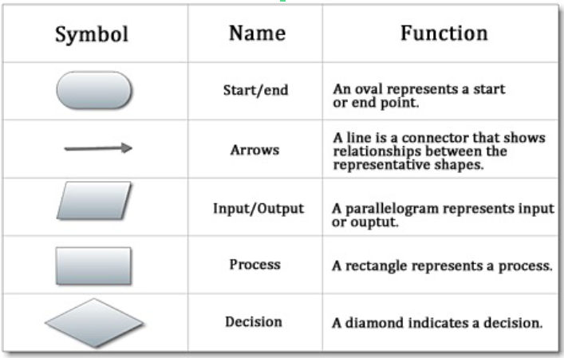
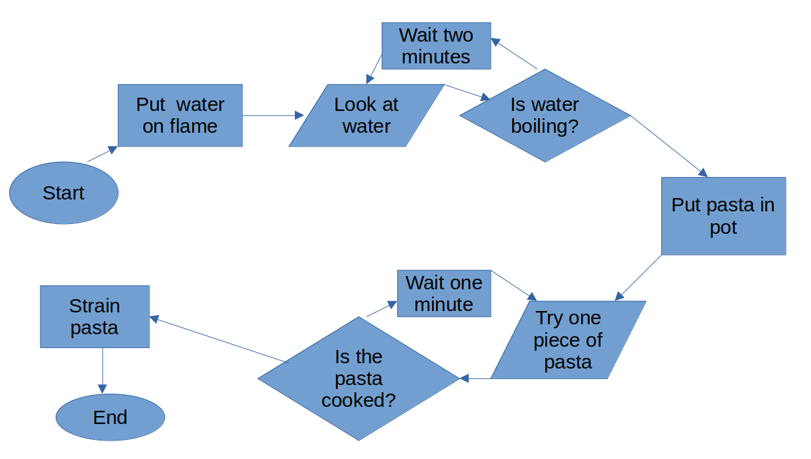
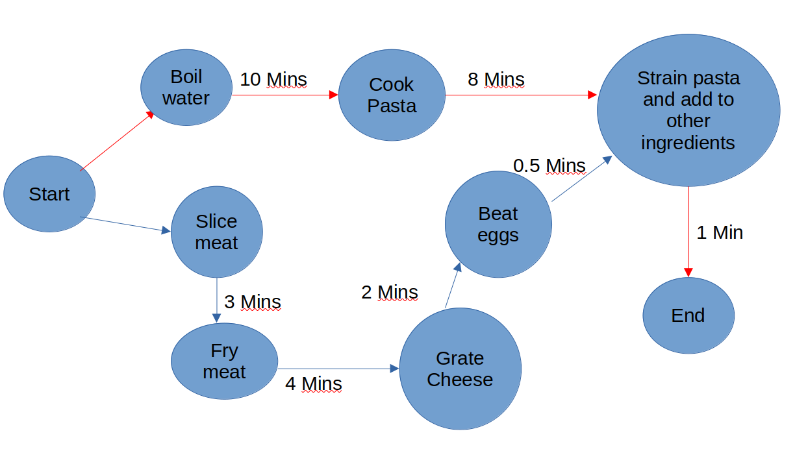
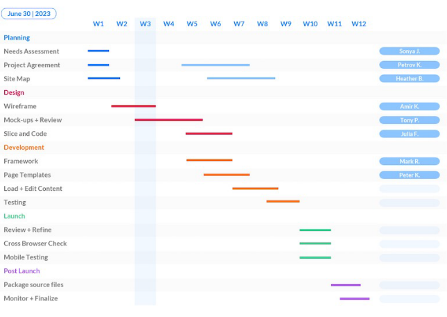
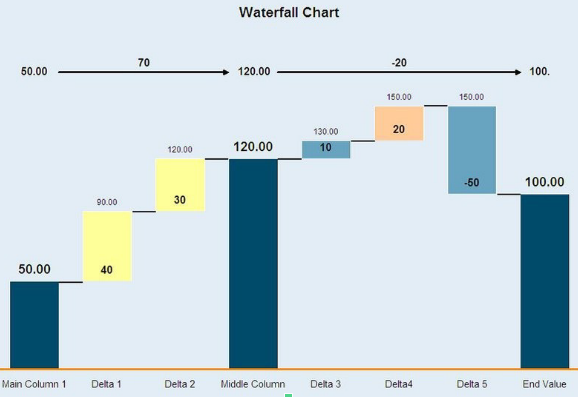
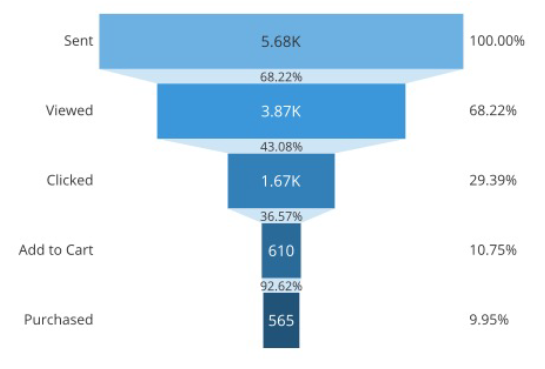

# Outline

- Flow Charts
- PERT Chart
- Gantt charts
- Waterfall/ Funnel
- More Sankey diagrams

```{r,include=FALSE}
library(reticulate)
use_python('~/anaconda3/bin/python3')
matplotlib<-import('matplotlib')
matplotlib$use("Agg",force=TRUE)
knitr::opts_chunk$set(fig.align='center',echo=FALSE,message = F,warning = F)
```

---

# Motivation

- Many business processes are easier to understand if visualised.
- This is particularly the case for project management.
- In this topic we will not be visualising observations and variables as we did in other topics
- However it does have similarities to graph theory and networks.

```{python}
import pandas as pd
import matplotlib.pyplot as plt
import seaborn as sns
import numpy as np
```


---

class: middle, center, inverse

# Flow charts


---

# Processes

- Critical to all businesses and large organisations.
- Can be complex and missing steps can be disastrous.
- Visualising processes with flow charts prevents such mistakes. 
- A flow chart helps with the organisation of workflow.

---

# Elements of a flow chart

- Start and end
- Inputs and outputs
- Processes
- Outputs
- Connections

---

# Flow chart symbols




---

# How to cook pasta



---

# Uses of flow charts

- We can use a flow chart to summarise our own workflow as data scientists.
  - Generate questions, tidy data visualise and back to questions again.
  - Flow charts can be useful to help you organise code.
- Sometimes the best projects start out with pen and paper!

---

# CPM/ PERT charts

- In many operations the Critical Path Method (CPM) and Program Evaluation and Review Technique (PERT) aid decision.
- The full implications of these go beyond the scope of the course.
- We will focus on the visual aspect.

---

# More pasta



---

# Critical path

- The purpose of CPM/PERT is to identify the *critical path*.
- In the pasta example, boiling the water and cooking the pasta take longer than the sauce.
- Any delays along the critical path leads to delays in the whole project.
- Note that we are visualising this as if it were a network.

---

# Gantt chart

- The Gantt chart was popularised by Henry Gantt in the early twentieth century.
- It was used primarily to make industrial processes more efficient. 
- It is particularly useful for showing how tasks can be done in parallel while waiting for other tasks to be completed.


---

# Example



---

# In Python


```{python, echo=TRUE}
import plotly.figure_factory as ff

df = [dict(Task="Job-1", Start='2021-06-01', Finish='2021-07-02', Resource='Complete'),
      dict(Task="Job-1", Start='2021-07-15', Finish='2021-08-15', Resource='In progress'),
      dict(Task="Job-2", Start='2021-06-17', Finish='2021-07-17', Resource='Not Started'),
      dict(Task="Job-2", Start='2021-06-17', Finish='2021-07-17', Resource='Complete'),
      dict(Task="Job-3", Start='2021-08-10', Finish='2021-08-15', Resource='Not Started'),
      dict(Task="Job-3", Start='2021-09-01', Finish='2021-09-20', Resource='Not Started'),
      dict(Task="Job-3", Start='2021-08-18', Finish='2021-11-18', Resource='Not Started'),
      dict(Task="Job-4", Start='2021-06-14', Finish='2021-08-14', Resource='Complete')] 
fig = ff.create_gantt(df, index_col='Resource',show_colorbar=True, group_tasks=True)
fig.write_html('gantt.html')
```

---

# Plot

<iframe src="gantt.html" title="Gantt" width="700" height="500"></iframe>


---

# Waterfall

- The waterfall chart shows time across the horizontal axis and the cumulative effects of payments on the vertical axis.
- It is useful for showing cash flows and revenue in financial analysis.
- Different colors may indicate different types of cash flow.

---


# Example



---

# Funnel

- The funnel shows values across multiple stages.
- Time is shown vertically
- It is a special case of a Sankey diagram.
- It is particularly useful in marketing applications

---


# Example



---

# Setup in Python

```{python, echo=T}
import plotly.express as px
data = dict(
    number=[4500, 1500, 750, 500, 250],
    stage=["Website visits", "Downloads", "Contacted by email", "Requested price", "Purchased"])
fig = px.funnel(data, x='number', y='stage')
fig.write_html('funnel.html')
```
---

# Funnel plot

<iframe src="funnel.html" title="Funnel" width="700" height="500"></iframe>

---


# Python

- Python code was not shown for every plot in this lecture.
- While these plots are popular in business
  - They require dedicated packages in Python or 
  - They can be customised with the usual visualisation libraries.
- Often they are easier to create with other software.

---

class: middle, center, inverse

# Wrap-up

---

# Conclusions

- There are many ways to visualise processes.
  - Often these rely on a graph / network visualisation.
  - In other cases they are quite unique.
- While these are often used for big organisations, you can use them as individuals to plan out your own workflows.

---

class: middle, center, inverse

# Questions
